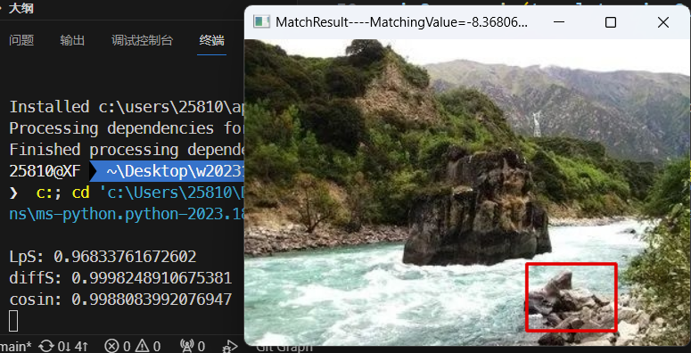
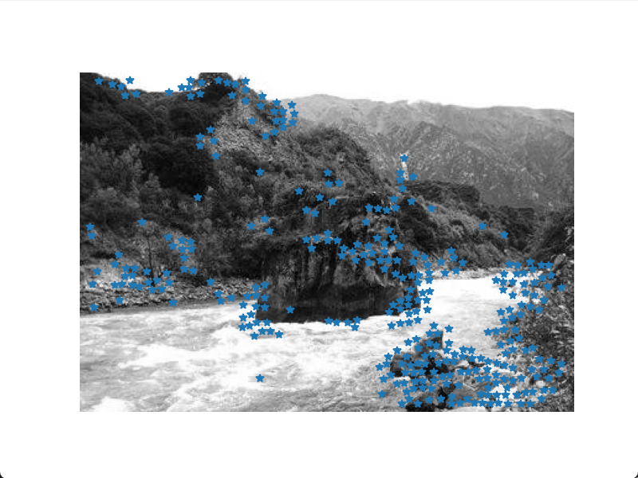

一些图像匹配相似度算法实现：
```python
import cv2
import numpy as np
import matplotlib.pyplot as plt


# Lp相似度
def LpS(X, Y, p=2.0):
    x = np.float64(X.reshape(-1))
    y = np.float64(Y.reshape(-1))
    n = len(x)
    return 1.0 - np.linalg.norm(x - y, p) / 255.0 / n ** (1.0 / p)


# 差相似度
def diffS(X, Y):
    x = np.float64(X.reshape(-1))
    y = np.float64(Y.reshape(-1))
    n = len(x)
    return 1.0 - np.abs(np.sum(x - y)) / 255.0 / n


# 余弦相似度
def cosin(X, Y):
    vector_a = np.float64(X.reshape(-1))
    vector_b = np.float64(Y.reshape(-1))
    num = np.dot(vector_a, vector_b)
    denom = np.linalg.norm(vector_a) * np.linalg.norm(vector_b)
    sim = num / denom
    return sim


# 古本（Tanimoto）相似度
def Tanimoto(X, Y):
    vector_a = np.float64(X.reshape(-1))
    vector_b = np.float64(Y.reshape(-1))
    num = np.dot(vector_a, vector_b)
    denom = np.dot(vector_a, vector_a) + np.dot(vector_b, vector_b) - num
    sim = num / denom
    return sim


# 皮尔逊（Pearson）相似度
def correlationN(X, Y):
    x = np.float64(X.reshape(-1))
    y = np.float64(Y.reshape(-1))
    return np.corrcoef(x, y)[0, 1]


# 结构相似度（SSIM）
def ssim(X, Y, data_range=255.0, K=(0.01, 0.03)):
    K1, K2 = K
    C1 = (K1 * data_range) ** 2
    C2 = (K2 * data_range) ** 2
    mu1 = np.mean(X)
    mu2 = np.mean(Y)
    mu1_sq = mu1**2
    mu2_sq = mu2**2
    mu12 = mu1 * mu2
    sigma1_sq = np.mean((X - mu1_sq) ** 2)
    sigma2_sq = np.mean((Y - mu2_sq) ** 2)
    sigma12 = np.mean((X - mu1_sq) * (Y - mu2_sq))
    cs_ = (2 * sigma12 + C2) / (sigma1_sq + sigma2_sq + C2)
    ssim_ = (2 * mu12 + C1) / (mu1_sq + mu2_sq + C1) * cs_
    return ssim_


# 平均结构相似度（MSSIM）
def Mssim(img1, img2):
    C1 = (0.01 * 255) ** 2
    C2 = (0.03 * 255) ** 2
    img1 = img1.astype(np.float64)
    img2 = img2.astype(np.float64)
    hws = 5
    sigma = 0.3 * hws
    kernel = cv2.getGaussianKernel(2 * hws + 1, sigma)
    window = np.outer(kernel, kernel.transpose())
    mu1 = cv2.filter2D(img1, -1, window)[hws:-hws, hws:-hws]
    mu2 = cv2.filter2D(img2, -1, window)[hws:-hws, hws:-hws]
    mu1_sq = mu1**2
    mu2_sq = mu2**2
    mu1_mu2 = mu1 * mu2
    sigma1_sq = cv2.filter2D(img1**2, -1, window)[hws:-hws, hws:-hws] - mu1_sq
    sigma2_sq = cv2.filter2D(img2**2, -1, window)[hws:-hws, hws:-hws] - mu2_sq
    sigma12 = cv2.filter2D(img1 * img2, -1, window)[hws:-hws, hws:-hws] - mu1_mu2
    ssim_map = ((2 * mu1_mu2 + C1) * (2 * sigma12 + C2)) / (
        (mu1_sq + mu2_sq + C1) * (sigma1_sq + sigma2_sq + C2)
    )
    return ssim_map.mean()


# 峰值信噪比（PSNR）
def psnr(X, Y):
    x = np.float64(X.reshape(-1))
    y = np.float64(Y.reshape(-1))
    mse = np.mean((x / 255 - y / 255) ** 2)
    if mse < 1.0e-10:
        return 100
    return 10 * np.log10(1.0**2 / mse)


# 获取直方图、显示结果
def GrayHist(img):
    grayHist = np.zeros(256, dtype=np.uint64)
    for v in range(256):
        grayHist[v] = np.sum(img == v)
    return grayHist


def showHistResult(hist1, hist2):
    plt.plot(hist1, color="b")
    plt.plot(hist2, color="r")
    plt.xlim(0, 256)
    plt.ylim(0, max(np.amax(hist1), np.amax(hist2)))
    plt.xticks([])
    plt.show()


# Lp相似度 for 直方图
def LpS_hist(hist1, hist2, p=2.0):
    x = np.float64(hist1.reshape(-1))
    y = np.float64(hist2.reshape(-1))
    n = len(x)
    x = x / np.sum(x)
    y = y / np.sum(y)
    return 1.0 - np.linalg.norm(x - y, p) / 2 ** (1.0 / p)


# SIFT特征匹配
# https://blog.csdn.net/wu_zhiyuan/article/details/126028766
# https://www.freesion.com/article/7751388844/
```

定位图片并使用多种算法计算相似度：
```python
from pptcode import *
import cv2
import numpy as np


# 读取目标图片
target = cv2.imread("./imgs/scenery4.jpg")
# 读取模板图片
template = cv2.imread("./imgs/scenery4-0.jpg")
# 获得模板图片的高宽尺寸
theight, twidth = template.shape[:2]
# 执行模板匹配，采用的匹配方式cv2.TM_SQDIFF_NORMED
result = cv2.matchTemplate(target, template, cv2.TM_SQDIFF_NORMED)
# 归一化处理
cv2.normalize(result, result, 0, 1, cv2.NORM_MINMAX, -1)
# 寻找矩阵（一维数组当做向量，用Mat定义）中的最大值和最小值的匹配结果及其位置
min_val, max_val, min_loc, max_loc = cv2.minMaxLoc(result)


# 截取
width, height = twidth, theight  # 显示卡片的宽和高
pts1 = np.float32(
    [
        [min_loc[0], min_loc[1]],
        [min_loc[0] + twidth, min_loc[1]],
        [min_loc[0], min_loc[1] + theight],
        [min_loc[0] + twidth, min_loc[1] + theight],
    ]
)  # 截取对片中的哪个区域
pts2 = np.float32([[0, 0], [width, 0], [0, height], [width, height]])  # 定义显示的卡片的坐标
matrix = cv2.getPerspectiveTransform(pts1, pts2)  # 两个区域坐标绑定
imgOutput = cv2.warpPerspective(target, matrix, (width, height))  # 转换为图片


# 匹配值转换为字符串
# 对于cv2.TM_SQDIFF及cv2.TM_SQDIFF_NORMED方法min_val越趋近与0匹配度越好，匹配位置取min_loc
# 对于其他方法max_val越趋近于1匹配度越好，匹配位置取max_loc
strmin_val = str(min_val)
# 绘制矩形边框，将匹配区域标注出来
# min_loc：矩形定点
# (min_loc[0]+twidth,min_loc[1]+theight)：矩形的宽高
# (0,0,225)：矩形的边框颜色；2：矩形边框宽度
cv2.rectangle(
    target, min_loc, (min_loc[0] + twidth, min_loc[1] + theight), (0, 0, 225), 2
)


sim1 = LpS(template, imgOutput)
print("LpS:", sim1)
sim2 = diffS(template, imgOutput)
print("diffS:", sim2)
sim3 = cosin(template, imgOutput)
print("cosin:", sim3)


# 显示结果,并将匹配值显示在标题栏上
cv2.imshow("MatchResult----MatchingValue=" + strmin_val, target)
cv2.waitKey()
cv2.destroyAllWindows()
```

运行结果：


角点检测算法：
```python
# 特征提取
# 局部图像描述子
# Harris角点检测
from pylab import *
from PIL import Image
from numpy import *
from scipy.ndimage import filters


def compute_harris_response(im, sigma=3):
    """在一幅灰度图像中，对每个像素计算Harris角点检测器响应函数"""
    # 计算导数
    imx = zeros(im.shape)
    filters.gaussian_filter(im, (sigma, sigma), (0, 1), imx)
    imy = zeros(im.shape)
    filters.gaussian_filter(im, (sigma, sigma), (1, 0), imy)
    # 计算Harris矩阵的分量
    Wxx = filters.gaussian_filter(imx * imx, sigma)
    Wxy = filters.gaussian_filter(imx * imy, sigma)
    Wyy = filters.gaussian_filter(imy * imy, sigma)
    # 计算特征值和迹
    Wdet = Wxx * Wyy - Wxy**2
    Wtr = Wxx + Wyy
    return Wdet / Wtr


def get_harris_points(harrisim, min_dist=10, threshold=0.1):
    """从一幅Harris响应图像中返回角点。min_dist为分割角点和图像边界的最小像素数目"""
    # 寻找高于阈值的候选角点
    corner_threshold = harrisim.max() * threshold
    harrisim_t = (harrisim > corner_threshold) * 1
    # 得到候选点的坐标
    coords = array(harrisim_t.nonzero()).T
    # 以及它们的Harris响应值
    candidate_values = [harrisim[c[0], c[1]] for c in coords]
    # 对候选点按照Harris响应值进行排序
    index = argsort(candidate_values)
    # 将可行点的位置保存到数组中
    allowed_locations = zeros(harrisim.shape)
    allowed_locations[min_dist:-min_dist, min_dist:-min_dist] = 1
    # 按照min_distance原则，选择最佳Harris点
    filtered_coords = []
    for i in index:
        if allowed_locations[coords[i, 0], coords[i, 1]] == 1:
            filtered_coords.append(coords[i])
            allowed_locations[
                (coords[i, 0] - min_dist) : (coords[i, 0] + min_dist),
                (coords[i, 1] - min_dist) : (coords[i, 1] + min_dist),
            ] = 0
    return filtered_coords


def plot_harris_points(image, filtered_coords):
    """绘制图像中检测到的角点"""
    figure()
    gray()
    imshow(image)
    plot([p[1] for p in filtered_coords], [p[0] for p in filtered_coords], "*")
    axis("off")
    show()


# 调用展示
im = array(Image.open("./imgs/scenery4.jpg").convert("L"))
harrisim = compute_harris_response(im)
filtered_coords = get_harris_points(harrisim, 6, 0.05)
plot_harris_points(im, filtered_coords)


# 图像匹配
from PIL import Image
from numpy import *
# import harris
from PCV.localdescriptors import harris
from pylab import *

wid = 5
im1 = array(Image.open("./imgs/scenery4-0.jpg").convert("L"))
im2 = array(Image.open("./imgs/scenery4.jpg").convert("L"))
harrisim = harris.compute_harris_response(im1, 5)
filtered_coords1 = harris.get_harris_points(harrisim, wid + 1, 0.2)
d1 = harris.get_descriptors(im1, filtered_coords1, wid)
harrisim = harris.compute_harris_response(im2, 5)
filtered_coords2 = harris.get_harris_points(harrisim, wid + 1, 0.2)
d2 = harris.get_descriptors(im2, filtered_coords2, wid)
print("starting matching")
```

运行结果：


多目标检测：
```python
# opencv模板匹配----多目标匹配
import cv2
import numpy

# 读取目标图片
target = cv2.imread("target.jpg")
# 读取模板图片
template = cv2.imread("template.jpg")
# 获得模板图片的高宽尺寸
theight, twidth = template.shape[:2]
# 执行模板匹配，采用的匹配方式cv2.TM_SQDIFF_NORMED
result = cv2.matchTemplate(target, template, cv2.TM_SQDIFF_NORMED)
# 归一化处理
# cv2.normalize( result, result, 0, 1, cv2.NORM_MINMAX, -1 )
# 寻找矩阵（一维数组当做向量，用Mat定义）中的最大值和最小值的匹配结果及其位置
min_val, max_val, min_loc, max_loc = cv2.minMaxLoc(result)
# 绘制矩形边框，将匹配区域标注出来
# min_loc：矩形定点
# (min_loc[0]+twidth,min_loc[1]+theight)：矩形的宽高
# (0,0,225)：矩形的边框颜色；2：矩形边框宽度
cv2.rectangle(
    target, min_loc, (min_loc[0] + twidth, min_loc[1] + theight), (0, 0, 225), 2
)
# 匹配值转换为字符串
# 对于cv2.TM_SQDIFF及cv2.TM_SQDIFF_NORMED方法min_val越趋近与0匹配度越好，匹配位置取min_loc
# 对于其他方法max_val越趋近于1匹配度越好，匹配位置取max_loc
strmin_val = str(min_val)
# 初始化位置参数
temp_loc = min_loc
other_loc = min_loc
numOfloc = 1
# 第一次筛选----规定匹配阈值，将满足阈值的从result中提取出来
# 对于cv2.TM_SQDIFF及cv2.TM_SQDIFF_NORMED方法设置匹配阈值为0.01
threshold = 0.01
loc = numpy.where(result < threshold)
# 遍历提取出来的位置
for other_loc in zip(*loc[::-1]):
    # 第二次筛选----将位置偏移小于5个像素的结果舍去
    if (temp_loc[0] + 5 < other_loc[0]) or (temp_loc[1] + 5 < other_loc[1]):
        numOfloc = numOfloc + 1
        temp_loc = other_loc
        cv2.rectangle(
            target,
            other_loc,
            (other_loc[0] + twidth, other_loc[1] + theight),
            (0, 0, 225),
            2,
        )
str_numOfloc = str(numOfloc)
# 显示结果,并将匹配值显示在标题栏上
strText = (
    "MatchResult----MatchingValue="
    + strmin_val
    + "----NumberOfPosition="
    + str_numOfloc
)
cv2.imshow(strText, target)
cv2.waitKey()
cv2.destroyAllWindows()
```

