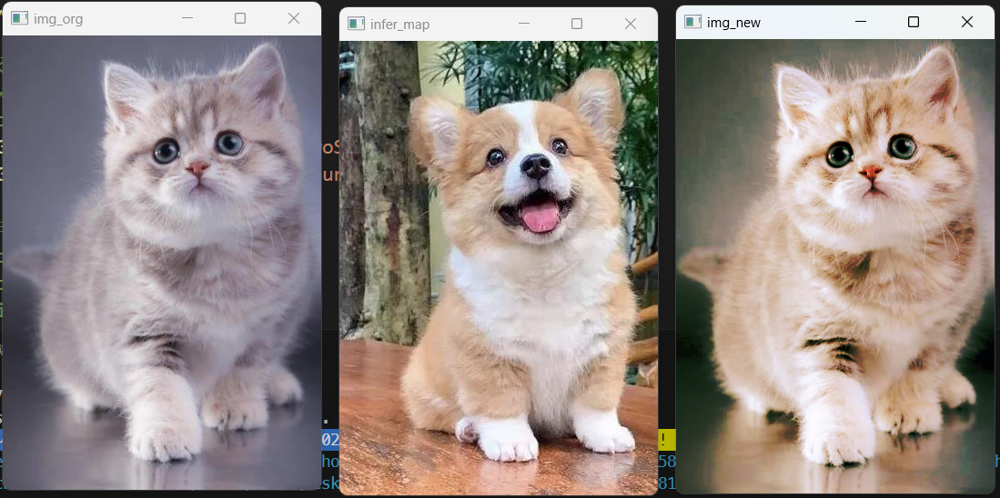
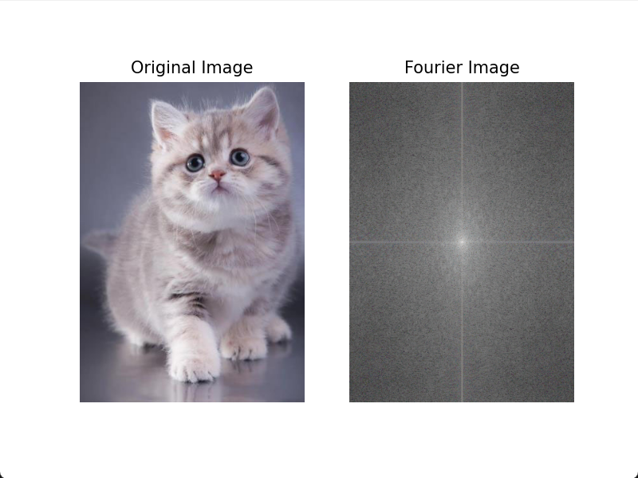

本次实验选用下面的一些图片：


解决了若干报错后的工具函数包：
```python
import matplotlib.pyplot as plt
import numpy as np
import cv2


# 图像增强
# 显示概率分布直方图和概率累计图
def showImgHist(img):
    fig, axes = plt.subplots(nrows=3, ncols=1, figsize=(4, 4))
    for c, c_color in enumerate(("b", "g", "r")):
        i_values, i_counts = np.unique(img[..., c], return_counts=True)
        i_quantiles = np.cumsum(i_counts.astype(np.float64))
        i_quantiles /= i_quantiles[-1]
        axes[c].hist(
            img[:, :, c].reshape(-1),
            density=True,
            bins=256,
            range=(0, 256),
            color=c_color,
        )
        axTw = axes[c].twinx()
        axTw.plot(i_values, i_quantiles, color="darkorange")  # 'gold'
        axTw.set_ylim(0, 1.0)
        axes[c].set_ylabel(c_color)
        axes[c].set_xlim(0, 256)
    plt.tight_layout()
    plt.show()
    # 可用于各种图像增强处理前后灰度直方图的变化对比


# 灰度变换
# 线性变换
def TwoSegment0(x, A, B, C):
    xcp = x.copy(x)
    xcp = np.where(x <= B, 127.0 * ((x - A) / (B - A + 0.0001)), xcp)
    xcp = np.where(x > B, 127.0 + 128.0 * ((x - B) / (C - B + 0.0001)), xcp)
    return np.clip(xcp, 0, 255)


def FourSegment0(x, A, B, C):
    # xcp = x.copy(x)
    # TypeError: order must be str, not numpy.ndarray
    xcp = x.copy()
    xcp = np.where(x <= A, 0.0 + 63.0 * ((x - 0) / (A - 0 + 0.0001)), xcp)
    xcp = np.where((x > A) & (x <= B), 63.0 + 64.0 * ((x - A) / (B - A + 0.0001)), xcp)
    xcp = np.where((x > B) & (x <= C), 127.0 + 64.0 * ((x - B) / (C - B + 0.0001)), xcp)
    xcp = np.where(x > C, 191.0 + 64.0 * ((x - C) / (255 - C + 0.0001)), xcp)
    return np.clip(xcp, 0, 255)


def cvBGRAdjust0(imData, saveName, f=FourSegment0, channel="rgb"):
    # 定义回调函数，此程序无需回调，所以Pass即可
    def callback(object):
        pass

    MAX_VALUE = 255  # 滑动条最大值
    MIN_VALUE = 0  # 滑动条最小值
    if f == TwoSegment0:
        a0, b0, c0 = 0, 127, 255
    if f == FourSegment0:
        a0, b0, c0 = 63, 127, 191
    cv2.namedWindow("cvAdjust", cv2.WINDOW_GUI_NORMAL)

    # cv2.resizeWindow("resized", imData.shape[0], imData.shape[1])
    # cv2.error: OpenCV(4.8.1) D:\a\opencv-python\opencv-python\opencv\modules\highgui\src\window_w32.cpp:1473: error: (-27:Null pointer) NULL window: 'resized' in function 'cvResizeWindow'
    cv2.resizeWindow("cvAdjust", imData.shape[1], imData.shape[0])
    cv2.createTrackbar("a", "cvAdjust", MIN_VALUE, MAX_VALUE, callback)
    cv2.createTrackbar("b", "cvAdjust", MIN_VALUE, MAX_VALUE, callback)
    cv2.createTrackbar("c", "cvAdjust", MIN_VALUE, MAX_VALUE, callback)
    cv2.setTrackbarPos("a", "cvAdjust", a0)
    cv2.setTrackbarPos("b", "cvAdjust", b0)
    cv2.setTrackbarPos("c", "cvAdjust", c0)
    while True:
        # BGRCopy = np.copy(imData).astype(np.float)  # 复制原图
        # AttributeError: module 'numpy' has no attribute 'float'.
        # `np.float` was a deprecated alias for the builtin `float`. To avoid this error in existing code, use `float` by itself. Doing this will not modify any behavior and is safe. If you specifically wanted the numpy scalar type, use `np.float64` here.
        # The aliases was originally deprecated in NumPy 1.20; for more details and guidance see the original release note at:
        #     https://numpy.org/devdocs/release/1.20.0-notes.html#deprecations. Did you mean: 'cfloat'?
        BGRCopy = np.copy(imData).astype(float)
        A = cv2.getTrackbarPos("a", "cvAdjust")
        B = cv2.getTrackbarPos("b", "cvAdjust")
        C = cv2.getTrackbarPos("c", "cvAdjust")
        b, g, r = cv2.split(BGRCopy)
        if "b" in channel:
            b = f(b, A, B, C)
        if "g" in channel:
            g = f(g, A, B, C)
        if "r" in channel:
            r = f(r, A, B, C)
        imBGR = cv2.merge(np.uint8([b, g, r]))
        cv2.imshow("cvAdjust", imBGR)
        ch = cv2.waitKey(5)  # 按 ESC 退出
        # if ch == 27 or ch == ord("s") or cv2.getWindowProperty("cvAdjust", 0) == -1:
        if (
            ch == 27
            or ch == ord("s")
            or cv2.getWindowProperty("cvAdjust", cv2.WND_PROP_VISIBLE) == 0
        ):
            cv2.imwrite(saveName + "-Adjusted.jpg", imBGR)  # 保存图片并退出
            break
    cv2.destroyAllWindows()  # 关闭窗口


# 非线性变换
def pow0(x, gamma):
    return x**gamma


def pow1(x, gamma):
    return 1 - (1 - x) ** gamma


def sigmoid0(x, gamma):
    gamma = gamma + 0.00001
    return (2 / (1 + np.exp(-gamma * x)) - 1) / (2 / (1 + np.exp(-gamma)) - 1)


def sigmoid1(x, gamma):
    gamma = gamma + 0.00001
    return 1 - (2 / (1 + np.exp(-gamma * (1 - x))) - 1) / (2 / (1 + np.exp(-gamma)) - 1)


def logic0(x, gamma):
    return 1 - np.log((1 - x) ** gamma + 1) / np.log(2)


def logic1(x, gamma):
    return np.log(x**gamma + 1) / np.log(2)


def s0(x, gamma):
    x = 2 * (x - 0.5)
    x = np.sign(x) * np.abs(x) ** gamma
    return x / 2.0 + 0.5


def cvBGRAdjust1(imData, saveName, f=sigmoid0, channel="rgb"):
    def callback(object):
        pass

    MAX_VALUE = 800  # 滑动条最大值
    MIN_VALUE = 0  # 滑动条最小值
    cv2.namedWindow("cvAdjust", cv2.WINDOW_GUI_NORMAL)
    # cv2.resizeWindow("cvAdjust", imData.shape[0], imData.shape[1])
    cv2.resizeWindow("cvAdjust", imData.shape[1], imData.shape[0])
    cv2.createTrackbar("gamma", "cvAdjust", MIN_VALUE, MAX_VALUE, callback)
    cv2.setTrackbarPos("gamma", "cvAdjust", 100)
    while True:
        # BGRCopy = np.copy(imData).astype(np.float)  # 复制原图
        BGRCopy = np.copy(imData).astype(float)  # 复制原图
        gamma = cv2.getTrackbarPos("gamma", "cvAdjust")
        b, g, r = cv2.split(BGRCopy / 255.0)
        if "b" in channel:
            b = f(b, gamma / 100)
        if "g" in channel:
            g = f(g, gamma / 100)
        if "r" in channel:
            r = f(r, gamma / 100)
        imBGR = cv2.merge(np.uint8([b * 255, g * 255, r * 255]))
        cv2.imshow("cvAdjust", imBGR)
        ch = cv2.waitKey(5)
        # if ch == 27 or ch == ord("s") or cv2.getWindowProperty("cvAdjust", 0) == -1:
        if (
            ch == 27
            or ch == ord("s")
            or cv2.getWindowProperty("cvAdjust", cv2.WND_PROP_VISIBLE) == 0
        ):
            cv2.imwrite(saveName + "-Adjusted.jpg", imBGR)
            break
    #     # 检查窗口是否存在
    #     rect = cv2.getWindowImageRect("cvAdjust")
    #     if not rect:
    #         break

    #     # 检查窗口是否被关闭
    #     if cv2.getWindowProperty("cvAdjust", 0) == -1:
    #         break

    #     # 等待按键
    #     key = cv2.waitKey(1)
    #     if key == 27:
    #         break
    # cv2.imwrite(saveName + "-Adjusted.jpg", imBGR)
    cv2.destroyAllWindows()
    # 非线性变换，变换函数取自定义曲线s0，可调节对比度


# 直方图规定化
def find_nearest_above(my_array, target):
    diff = my_array - target
    mask = np.ma.less_equal(diff, -1)
    if np.all(mask):
        c = np.abs(diff).argmin()
        return c  # 如果目标大于任何值，则返回最近的最小索引
    masked_diff = np.ma.masked_array(diff, mask)
    return masked_diff.argmin()


def hist_match(original, specified):
    oldshape = original.shape
    original = original.ravel()
    specified = specified.ravel()
    # 获取唯一像素值集合及其相应的索引和计数
    s_values, bin_idx, s_counts = np.unique(
        original, return_inverse=True, return_counts=True
    )
    t_values, t_counts = np.unique(specified, return_counts=True)
    s_quantiles = np.cumsum(s_counts).astype(np.float64)
    s_quantiles /= s_quantiles[-1]  # 计算原始图片的s_k
    t_quantiles = np.cumsum(t_counts).astype(np.float64)
    t_quantiles /= t_quantiles[-1]  # 计算参考图片的s_k
    sour = np.around(s_quantiles * 255)  # 四舍五入
    temp = np.around(t_quantiles * 255)
    b = []  # 映射舍入值
    for data in sour[:]:
        b.append(find_nearest_above(temp, data))
    b = np.array(b, dtype="uint8")
    return b[bin_idx].reshape(oldshape)


def get_hist_match(img_org, infer_map):
    img_new = np.zeros_like(img_org)  # infer_map可以自定义或者来自不同图片
    for i in range(3):
        img_new[:, :, i] = hist_match(img_org[:, :, i], infer_map[:, :, i])
    cv2.imshow("img_org", img_org)
    cv2.imshow("infer_map", infer_map)
    cv2.imshow("img_new", img_new)
    cv2.waitKey(0)
    cv2.destroyAllWindows()


# 显示频谱图
def spectrum_show(img, logarithm=True):
    # 定义一个用于计算频谱图并显示的函数
    gray = np.expand_dims(img, axis=-1) if img.ndim == 2 else img
    f_img = np.zeros(gray.shape)
    for i in range(gray.shape[2]):
        fimg = np.fft.fft2(gray[:, :, i])  # 快速傅里叶变换算法得到频率分布
        fimg = np.fft.fftshift(fimg)  # 将图像中的低频部分移动到图像的中心，默认是在左上角
        fimg = np.abs(fimg)  # 仟代结果是复数，其绝对值结果是振幅
        # fimg = np.angle(fshift)  # 相位
        f_img[:, :, i] = fimg
    if logarithm:
        f_img = np.log(1 + f_img)  # 取对数的目的是使较小值也能显示
    f_img = f_img / np.amax(f_img)
    if img.ndim == 2:
        new_img = np.squeeze(f_img, -1)
    else:
        img = img[:, :, [2, 1, 0]]
        f_img = f_img[:, :, [2, 1, 0]]
    print(np.amax(f_img), np.amin(f_img))
    # 展示结果
    plt.subplot(121), plt.imshow(img, "gray"), plt.title("Original Image")
    plt.axis("off")
    plt.subplot(122), plt.imshow(f_img, "gray"), plt.title("Fourier Image")
    plt.axis("off")
    plt.show()
    # 用于各种图像增强处理前后频域图像的变化对比


# 频域滤波
def cal_distance(pa, pb):  # 欧拉距离计算函数的定义
    return np.sqrt((pa[0] - pb[0]) ** 2 + (pa[1] - pb[1]) ** 2)


def IdealLowPass(dis, d, n):  # 理想低通滤波n为无效参数
    return np.where(dis > d, 0.0, 1.0)


def ButterworthLowPass(dis, d, n):  # 巴特沃斯低通滤波
    return 1 / (1 + (dis / d) ** (2.0 * n))


def GaussianLowPass(dis, d, n):  # 高斯低通滤波
    return np.exp(-(dis**2) / d**2 / 2)


def IdealhighPass(dis, d, n):  # 理想高通波n为无效参数
    return np.where(dis < d, 0.0, 1.0)


def ButterworthhighPass(dis, d, n):  # 巴特沃斯高通滤波
    return 1 / (1 + (d / dis) * (2.0 * n))


def GaussianhighPass(dis, d, n):  # 高斯高通滤波
    return 1 - np.exp(-(dis**2) / d**2 / 2)


def GaussianhighPassEmphasize(dis, d, n):  # 高斯高通高频强调
    return 1 - np.exp(-(dis**2) / d**2 / 2) + 0.12


def _spectralFilter(fftImg, f, d, n):
    nx, ny = fftImg.shape[0], fftImg.shape[1]
    pos_matrix = np.mgrid[0:nx, 0:ny]  # 位置
    center_point = tuple(map(lambda x: (x - 1) / 2, fftImg.shape))  # 中心点
    dis = cal_distance(pos_matrix, center_point)
    passVal = f(dis, d, n)
    # spectrum_show(passVal)
    return fftImg * passVal


def spectralFilter(img, f=GaussianhighPassEmphasize, d=10, n=5):
    # img=cv2.cvtColor(img,cv2.COLOR_BGR2GRAY)
    gray = np.expand_dims(img, axis=-1) if img.ndim == 2 else img
    new_img = np.zeros(gray.shape)
    for i in range(gray.shape[2]):
        fImg = np.fft.fft2(gray[:, :, i])  # 快速傅里叶变换算法得到频率分布
        fImg = np.fft.fftshift(fImg)  # 将图像中的低频部分移动到图像的中心，默认是在左上角
        fImg = _spectralFilter(fImg, f, d, n)
        new_img[:, :, i] = np.abs(np.fft.ifft2(np.fft.ifftshift(fImg)))  # 生成新图
    new_img = np.uint8(new_img / np.amax(new_img) * 255)
    if img.ndim == 2:
        new_img = np.squeeze(new_img, -1)
    spectrum_show(new_img)
    return new_img


# 同态滤波
def homomorphic_filter(img, d0=2, r1=1.0, rh=2.0, c=4, h=2.0, l=0.5):
    img = cv2.cvtColor(img, cv2.COLOR_BGR2GRAY)
    imgray = np.expand_dims(img, axis=-1) if img.ndim == 2 else img
    new_img = np.zeros(imgray.shape)
    for i in range(imgray.shape[2]):
        gray = imgray[:, :, i]
        gray = np.float64(gray)
        gray = np.log(gray + 1.0) / np.log(256)  # 对数域归一化
        gray_fftshift = np.fft.fftshift(np.fft.fft2(gray))  # 傅里叶变换
        # arange函数用于创建等差数组
        rows, cols = gray.shape
        M, N = np.meshgrid(
            np.arange(-cols // 2, cols // 2), np.arange(-rows // 2, rows // 2)
        )  # 注意，/就是除法
        # 频域滤波
        D = np.sqrt(M**2 + N**2)
        Z = (rh - r1) * (1 - np.exp(-c * (D**2 / d0**2))) + r1  # filter
        dst_fftshift = Z * gray_fftshift
        # dst_fftshift = (h - 1) * dst_fftshift + 1
        # 傅里叶反变换（之前是正变换，现在该反变换变回去了）
        dst_ifft = np.fft.ifft2(np.fft.ifftshift(dst_fftshift))
        dst = np.abs(dst_ifft)  # 选取元素的模
        dst = np.exp(dst) - 1  # 对数反变换
        new_img[:, :, i] = dst
    new_img = (new_img - new_img.min()) / (new_img.max() - new_img.min())
    new_img *= 255
    new_img = np.uint8(np.clip(new_img, 0, 255))
    if img.ndim == 2:
        new_img = np.squeeze(new_img, -1)
    out_img = np.hstack((img, new_img))
    cv2.imwrite("homomorphic filter.jpg", out_img)
    spectrum_show(new_img)
    return new_img


# 同态滤波SL
def homomorphic_filter_HSL(img, d0=2, r1=1.0, rh=2.0, c=4, h=2.0, l=0.5):
    imgHSL = cv2.cvtColor(img, cv2.COLOR_BGR2HLS)
    new_img = imgHSL.copy()
    for i in [1, 2]:
        gray = imgHSL[:, :, i]
        gray = np.float64(gray)
        gray = np.log(gray + 1.0) / np.log(256)  # 对数域归一化
        gray_fftshift = np.fft.fftshift(np.fft.fft2(gray))  # 傅里叶变换
        # arange函数用于创建等差数组
        rows, cols = gray.shape
        M, N = np.meshgrid(
            np.arange(-cols // 2, cols // 2), np.arange(-rows // 2, rows // 2)
        )
        # 注意，/就是除法
        # 频域滤波
        D = np.sqrt(M**2, N**2)
        Z = (rh - r1) * (1 - np.exp(-c * (D**2 / d0**2))) + r1  # filter
        dst_fftshift = Z * gray_fftshift
        # dst_fftshift = (h - 1) * dst_fftshift + l
        # 傅里叶反变换（之前是正变换，现在该反变换变回去了）
        dst_ifft = np.fft.ifft2(np.fft.ifftshift(dst_fftshift))
        dst = np.abs(dst_ifft)  # 选取元素的模
        dst = np.exp(dst) - 1  # 对数反变换
        dst = (dst - dst.min()) / (dst.max() - dst.min())
        new_img[:, :, i] = np.uint8(np.clip(dst * 255, 0, 255))
    new_img = cv2.cvtColor(new_img, cv2.COLOR_HLS2BGR)
    out_img = np.hstack((img, new_img))
    cv2.imwrite("homomorphic filter.jpg", out_img)
    spectrum_show(new_img)
    return new_img
    # HSL SL两个通道分别滤波，H不变


# 伪彩色着色
from scipy.interpolate import interp1d  # 插值通数


def hex_to_rgb(value):
    value = value.lstrip("#")
    lv = len(value)
    return np.array([int(value[i : i + lv // 3], 16) for i in range(0, lv, lv // 3)])


def colorpalette(cdict=["#313695", "#FEFEC0", "#A60126"], N=256):
    # 白青绿黄红
    # cdict=['#FFFFFF','#9ff113,'#5fbb44','#f5f329','#e50b32']
    rgblist = np.array([hex_to_rgb(i) for i in cdict])
    cpalette = np.zeros((N, 3))
    cpos = np.arange(len(cdict)) / (len(cdict) - 1)
    cpos_ = np.arange(N) / (N - 1)
    for i in range(3):
        f = interp1d(cpos, rgblist[:, i], kind="linear")  # cubic
        cpalette[:, i] = f(cpos_)
    return np.uint8(cpalette)


def applyColorMap(img, cmap):
    if img.ndim == 3:
        img = cv2.cvtColor(img, cv2.COLOR_BGR2GRAY)
    lmap = len(cmap)
    img = np.uint8(img / np.max(img) * (lmap - 1))
    img = cmap[img]
    return img[:, :, [2, 1, 0]]  # RGB2BGR


def pseudocolorFlower(img):
    cflower = colorpalette(["#000000", "#e50b32", "#f5f329"])
    cleaf = colorpalette(["#000000", "#185208", "5ae22a", "#5fbb44"])
    tozero_path, th1 = cv2.threshold(img, 108, 255, cv2.THRESH_TOZERO)
    tozero_path_inv, th2 = cv2.threshold(img, 108, 255, cv2.THRESH_TOZERO_INV)
    th1_color = applyColorMap(th1, cflower)  # 花的配色
    th2_color = applyColorMap(th2, cleaf)
    # 叶的配色
    img_color = cv2.addWeighted(th1_color, 0.8, th2_color, 0.2, 0)
    th_mask = np.where(th1 < 0.5, 0.0, 1.0)
    th_mask = cv2.GaussianBlur(th_mask, (3, 3), 0.0)  # 羽化交界处
    img_color = np.uint8(th_mask * th1_color + (1 - th_mask) * th2_color)
    out_img1 = np.hstack((img, th1, th2))
    out_img2 = np.hstack((th1_color, th2_color, img_color))
    out_img = np.vstack((out_img1, out_img2))
    cv2.imwrite("pseudocolorFLower.jpg", out_img)
    return img_color


# 颜色变换
def cvHSLAdjust0(imData, saveName):
    def callback(object):
        pass

    MAX_VALUE2 = 800  # 滑动条最大值
    MIN_VALUE2 = 1  # 滑动条最小值
    cv2.namedWindow("cvAdjust", cv2.WINDOW_GUI_NORMAL)  # 调节饱和度和高度的窗口
    cv2.resizeWindow("cvAdjust", imData.shape[1], imData.shape[0])
    # cv2.resizeWindow("resized", imData.shape[0], imData.shape[1])
    cv2.createTrackbar("lgamma", "cvAdjust", MIN_VALUE2, MAX_VALUE2, callback)
    cv2.createTrackbar("sgamma", "cvAdjust", MIN_VALUE2, MAX_VALUE2, callback)
    cv2.createTrackbar("inverted", "cvAdjust", 0, 1, callback)
    cv2.setTrackbarPos("lgamma", "cvAdjust", 100)
    cv2.setTrackbarPos("sgamma", "cvAdjust", 100)
    hls = cv2.cvtColor(imData, cv2.COLOR_BGR2HLS)
    while True:  # 调整饱和度和亮度
        # hlsCopy = np.copy(hls).astype(np.float)  # 复制原图
        hlsCopy = np.copy(hls).astype(float)  # 复制原图
        lgamma = cv2.getTrackbarPos("lgamma", "cvAdjust")
        sgamma = cv2.getTrackbarPos("sgamma", "cvAdjust")
        inverted = cv2.getTrackbarPos("inverted", "cvAdjust")

        l = s0(hlsCopy[:, :, 1] / 255.0, lgamma / 100.0)  # 调整亮度
        s = s0(hlsCopy[:, :, 2] / 255.0, sgamma / 100.0)  # 饱和度
        hlsCopy[:, :, 1] = l * 255
        hlsCopy[:, :, 2] = s * 255
        imBGR = cv2.cvtColor(np.uint8(hlsCopy), cv2.COLOR_HLS2BGR)  # HLS2BGR
        if inverted == 1:
            imBGR = 255 - imBGR
        cv2.imshow("cvAdjust", imBGR)
        ch = cv2.waitKey(5)  # ESC键s键退出
        # if ch == 27 or ch == ord("s") or cv2.getWindowProperty("cvAdjust", 0) == -1:
        if (
            ch == 27
            or ch == ord("s")
            or cv2.getWindowProperty("cvAdjust", cv2.WND_PROP_VISIBLE) == 0
        ):
            cv2.imwrite(saveName + "-Adjusted.jpg", imBGR)  # 保存图片并退出
            break
    cv2.destroyAllWindows()  # 关闭窗口


def cvHSLAdjust1(imData, saveName):
    def callback(object):
        pass

    MAX_VALUE0, MAX_VALUE1, MAX_VALUE2 = 360, 250, 800
    MIN_VALUE1, MIN_VALUE2 = 0, 1
    cv2.namedWindow("cvAdjust", cv2.WINDOW_GUI_NORMAL)
    cv2.resizeWindow("cvAdjust", imData.shape[1], imData.shape[0])
    # cv2.resizeWindow("resized", imData.shape[0], imData.shape[1])
    cv2.createTrackbar("Hue", "cvAdjust", MIN_VALUE1, MAX_VALUE0, callback)
    cv2.createTrackbar("saturation", "cvAdjust", MIN_VALUE1, MAX_VALUE1, callback)
    cv2.createTrackbar("lgamma", "cvAdjust", MIN_VALUE2, MAX_VALUE2, callback)
    cv2.createTrackbar("inverted", "cvAdjust", 0, 1, callback)
    cv2.setTrackbarPos("Hue", "cvAdjust", 0)
    cv2.setTrackbarPos("saturation", "cvAdjust", 100)
    cv2.setTrackbarPos("lgamma", "cvAdjust", 100)
    hls = cv2.cvtColor(imData, cv2.COLOR_BGR2HLS)
    while True:
        hlsCopy = np.copy(hls).astype(float)
        hue = cv2.getTrackbarPos("Hue", "cvAdjust")
        saturation = cv2.getTrackbarPos("saturation", "cvAdjust")
        lgamma = cv2.getTrackbarPos("lgamma", "cvAdjust")
        inverted = cv2.getTrackbarPos("inverted", "cvAdjust")
        h = np.mod((hlsCopy[:, :0] + hue / 2.0), 180)  #
        s = (1.0 + (saturation - 100) / float(100)) * hlsCopy[:, :, 2] / 255.0  # 饱和度
        l = (hlsCopy[:, :, 1] / 255.0) ** (lgamma / 100.0)
        hlsCopy[:, :0] = h
        hlsCopy[:, :, 1] = l * 255 + 0.01
        hlsCopy[:, :, 2] = s * 255 + 0.01
        imBGR = cv2.cvtColor(np.uint8(hlsCopy), cv2.COLOR_HLS2BGR)  # HLS2BGR
        if inverted == 1:
            imBGR = 255 - imBGR
        cv2.imshow("cvAdjust", imBGR)
        ch = cv2.waitKey(5)  # ESC键s键退出
        # if ch == 27 or ch == ord("s") or cv2.getWindowProperty("cvAdjust", 0) == -1:
        if (
            ch == 27
            or ch == ord("s")
            or cv2.getWindowProperty("cvAdjust", cv2.WND_PROP_VISIBLE) == 0
        ):
            cv2.imwrite(saveName + "-Adjusted.jpg", imBGR)  # 保存图片并退出
            break
    cv2.destroyAllWindows()  # 关闭窗口
    # 在HSL空间操作，SL通道自定义灰度变换，H通道平移色相


def cvHSLAdjust2(imData, saveName):
    def callback(object):
        pass

    MAX_VALUE1, MAX_VALUE2 = 250, 800
    MIN_VALUE1, MIN_VALUE2 = 0, 1
    cv2.namedWindow("cvAdjust", cv2.WINDOW_GUI_NORMAL)
    cv2.resizeWindow("cvAdjust", imData.shape[1], imData.shape[0])
    # cv2.resizewindow("resized", imData.shape[0], imData.shape[1])
    cv2.createTrackbar("lightness", "cvAdjust", MIN_VALUE1, MAX_VALUE1, callback)
    cv2.createTrackbar("saturation", "cvAdjust", MIN_VALUE1, MAX_VALUE1, callback)
    cv2.createTrackbar("lgamma", "cvAdjust", MIN_VALUE2, MAX_VALUE2, callback)
    cv2.createTrackbar("sgamma", "cvAdjust", MIN_VALUE2, MAX_VALUE2, callback)
    cv2.createTrackbar("inverted", "cvAdjust", 0, 1, callback)
    cv2.setTrackbarPos("lightness", "cvAdjust", 100)
    cv2.setTrackbarPos("saturation", "cvAdjust", 100)
    cv2.setTrackbarPos("lgamma", "cvAdjust", 100)
    cv2.setTrackbarPos("sgamma", "cvAdjust", 100)
    hls = cv2.cvtColor(imData, cv2.COLOR_BGR2HLS)
    while True:
        hlsCopy = np.copy(hls).astype(np.float32)
        lightness = cv2.getTrackbarPos("lightness", "cvAdjust")
        saturation = cv2.getTrackbarPos("saturation", "cvAdjust")
        lgamma = cv2.getTrackbarPos("lgamma", "cvAdjust")
        sgamma = cv2.getTrackbarPos("sgamma", "cvAdjust")
        inverted = cv2.getTrackbarPos("inverted", "cvAdjust")
        l = (1.0 + (lightness - 100) / float(100)) * hlsCopy[:, :, 1] / 255.0
        l[l > 1] = 1
        s = (1.0 + (saturation - 100) / float(100)) * hlsCopy[:, :, 2] / 255.0
        s[s > 1] = 1
        l = l ** (lgamma / 100.0)
        s = s ** (sgamma / 100.0)
        hlsCopy[:, :, 1] = np.uint8(l * 255 + 0.01)
        hlsCopy[:, :, 2] = np.uint8(s * 255 + 0.01)
        imBGR = cv2.cvtColor(hlsCopy, cv2.COLOR_HLS2BGR)
        if inverted == 1:
            imBGR = 255 - imBGR
        cv2.imshow("cvAdjust", imBGR)
        ch = cv2.waitKey(5)  # ESC键s键退出
        # if ch == 27 or ch == ord("s") or cv2.getWindowProperty("cvAdjust", 0) == -1:
        if (
            ch == 27
            or ch == ord("s")
            or cv2.getWindowProperty("cvAdjust", cv2.WND_PROP_VISIBLE) == 0
        ):
            # print("break")
            cv2.imwrite(saveName + "-Adjusted.jpg", imBGR)  # 保存图片并退出
            break
    cv2.destroyAllWindows()  # 关闭所有的窗口
```

首先分别选合适的图片，通过灰度变换、直方图规定化、频域滤波、伪彩色着色等方法进行图像增强。

```python
from util import *
import cv2

# 加载图片
dogImg = cv2.imread("./imgs/dog.jpg")
catImg = cv2.imread("./imgs/cat.jpg")

# 展示直方图
showImgHist(dogImg)
showImgHist(catImg)
```


```python
# 灰度变换
# TwoSegment0
# FourSegment0
cvBGRAdjust0(dogImg, "dogImg0-TwoSegment0", f=TwoSegment0)
cvBGRAdjust0(dogImg, "dogImg0-FourSegment0", f=FourSegment0)
```


```python
# 非线性灰度变换
# pow0
# pow1
# sigmoid0
# sigmoid1
# logic0
# logic1
# s0
cvBGRAdjust1(dogImg, "dogImg1-pow0", f=pow0)
cvBGRAdjust1(dogImg, "dogImg1-pow1", f=pow1)
cvBGRAdjust1(dogImg, "dogImg1-sigmoid0", f=sigmoid0)
cvBGRAdjust1(dogImg, "dogImg1-sigmoid1", f=sigmoid1)
cvBGRAdjust1(dogImg, "dogImg1-logic0", f=logic0)
cvBGRAdjust1(dogImg, "dogImg1-logic1", f=logic1)
cvBGRAdjust1(dogImg, "dogImg1-s0", f=s0)
```


```python
# 直方图规定化
# 参考infer_map给img_org配色
get_hist_match(dogImg, catImg)
get_hist_match(catImg, dogImg)
```




```python
# 显示频谱图
spectrum_show(dogImg)
spectrum_show(catImg)
```




```python
# 频域滤波
# cal_distance
# IdealLowPass
# ButterworthLowPass
# GaussianLowPass
# IdealhighPass
# ButterworthhighPass
# GaussianhighPass
# GaussianhighPassEmphasize
spectralFilter(dogImg, f=cal_distance)
spectralFilter(dogImg, f=IdealLowPass)
spectralFilter(dogImg, f=ButterworthLowPass)
spectralFilter(dogImg, f=GaussianLowPass)
spectralFilter(dogImg, f=IdealhighPass)
spectralFilter(dogImg, f=ButterworthhighPass)
spectralFilter(dogImg, f=GaussianhighPass)
spectralFilter(dogImg, f=GaussianhighPassEmphasize)


# 同态滤波
homomorphic_filter(dogImg)
homomorphic_filter(catImg)

homomorphic_filter_HSL(dogImg)
homomorphic_filter_HSL(catImg)
```


```python
# 伪彩色着色
flower = cv2.imread("./imgs/flower.jpg")
pseudocolorFlower(flower)

# 色彩变换
cvHSLAdjust0(dogImg, "dogImg0-HSLAdjust0")
cvHSLAdjust1(dogImg, "dogImg1-HSLAdjust1")
cvHSLAdjust2(dogImg, "dogImg2-HSLAdjust2")
```


联合几何变换类和颜色变换类方法，为同一张图片进行数据扩充，部分代码及图片展示如下：
```python
import cv2
import numpy as np

# 读取图片
img = cv2.imread("./imgs/cat.jpg")

# 几何变换
rows, cols, _ = img.shape
M = cv2.getRotationMatrix2D((cols / 2, rows / 2), 30, 1)
img_rotate = cv2.warpAffine(img, M, (cols, rows))
img_flip = cv2.flip(img, 1)

# 颜色变换
img_hsv = cv2.cvtColor(img, cv2.COLOR_BGR2HSV)
img_h, img_s, img_v = cv2.split(img_hsv)
img_h = cv2.equalizeHist(img_h)
img_s = cv2.equalizeHist(img_s)
img_v = cv2.equalizeHist(img_v)
img_hsv_eq = cv2.merge([img_h, img_s, img_v])
img_gray = cv2.cvtColor(img, cv2.COLOR_BGR2GRAY)
img_gray_eq = cv2.equalizeHist(img_gray)

# 显示结果
cv2.imshow("Original", img)
cv2.imshow("Rotated", img_rotate)
cv2.imshow("Flipped", img_flip)
cv2.imshow("HSV Equalized", cv2.cvtColor(img_hsv_eq, cv2.COLOR_HSV2BGR))
cv2.imshow("Gray Equalized", cv2.cvtColor(img_gray_eq, cv2.COLOR_GRAY2BGR))
cv2.waitKey(0)
cv2.destroyAllWindows()
```


```python
import cv2
import numpy as np
from util import *

# 加载图片
img = cv2.imread("./imgs/cat.jpg")

# 几何变换
rows, cols, _ = img.shape
M = cv2.getRotationMatrix2D((cols / 2, rows / 2), 30, 1)
img_rotate = cv2.warpAffine(img, M, (cols, rows))
img_flip = cv2.flip(img, 1)

# 颜色变换
img_hsv = cv2.cvtColor(img, cv2.COLOR_BGR2HSV)
img_h, img_s, img_v = cv2.split(img_hsv)
img_h = cv2.equalizeHist(img_h)
img_s = cv2.equalizeHist(img_s)
img_v = cv2.equalizeHist(img_v)
img_hsv_eq = cv2.merge([img_h, img_s, img_v])
img_gray = cv2.cvtColor(img, cv2.COLOR_BGR2GRAY)
img_gray_eq = cv2.equalizeHist(img_gray)

# 数据扩充
cvBGRAdjust0(img, "img-TwoSegment0", f=TwoSegment0)
cvBGRAdjust0(img, "img-FourSegment0", f=FourSegment0)
cvBGRAdjust0(img, "img-pow0", f=pow0)
cvBGRAdjust0(img, "img-pow1", f=pow1)
cvBGRAdjust0(img, "img-sigmoid0", f=sigmoid0)
cvBGRAdjust0(img, "img-sigmoid1", f=sigmoid1)
cvBGRAdjust0(img_rotate, "img_rotate-TwoSegment0", f=TwoSegment0)
cvBGRAdjust0(img_rotate, "img_rotate-FourSegment0", f=FourSegment0)
cvBGRAdjust0(img_rotate, "img_rotate-pow0", f=pow0)
cvBGRAdjust0(img_rotate, "img_rotate-pow1", f=pow1)
cvBGRAdjust0(img_rotate, "img_rotate-sigmoid0", f=sigmoid0)
cvBGRAdjust0(img_rotate, "img_rotate-sigmoid1", f=sigmoid1)
cvBGRAdjust0(img_flip, "img_flip-TwoSegment0", f=TwoSegment0)
cvBGRAdjust0(img_flip, "img_flip-FourSegment0", f=FourSegment0)
cvBGRAdjust0(img_flip, "img_flip-pow0", f=pow0)
cvBGRAdjust0(img_flip, "img_flip-pow1", f=pow1)
cvBGRAdjust0(img_flip, "img_flip-sigmoid0", f=sigmoid0)
cvBGRAdjust0(img_flip, "img_flip-sigmoid1", f=sigmoid1)
cvBGRAdjust0(img_hsv_eq, "img_hsv_eq-TwoSegment0", f=TwoSegment0)
cvBGRAdjust0(img_hsv_eq, "img_hsv_eq-FourSegment0", f=FourSegment0)
cvBGRAdjust0(img_hsv_eq, "img_hsv_eq-pow0", f=pow0)
cvBGRAdjust0(img_hsv_eq, "img_hsv_eq-pow1", f=pow1)
cvBGRAdjust0(img_hsv_eq, "img_hsv_eq-sigmoid0", f=sigmoid0)
cvBGRAdjust0(img_hsv_eq, "img_hsv_eq-sigmoid1", f=sigmoid1)
cvBGRAdjust0(img_gray_eq, "img_gray_eq-TwoSegment0", f=TwoSegment0)
cvBGRAdjust0(img_gray_eq, "img_gray_eq-FourSegment0", f=FourSegment0)
cvBGRAdjust0(img_gray_eq, "img_gray_eq-pow0", f=pow0)
cvBGRAdjust0(img_gray_eq, "img_gray_eq-pow1", f=pow1)
cvBGRAdjust0(img_gray_eq, "img_gray_eq-sigmoid0", f=sigmoid0)
cvBGRAdjust0(img_gray_eq, "img_gray_eq-sigmoid1", f=sigmoid1)

# 显示结果
cv2.imshow("Original", img)
cv2.imshow("Rotated", img_rotate)
cv2.imshow("Flipped", img_flip)
cv2.imshow("HSV Equalized", cv2.cvtColor(img_hsv_eq, cv2.COLOR_HSV2BGR))
cv2.imshow("Gray Equalized", cv2.cvtColor(img_gray_eq, cv2.COLOR_GRAY2BGR))
cv2.waitKey(0)
cv2.destroyAllWindows()
```

