图像融合 (Image Fusion) 是指综合多幅输入图像的信息，以获得更高质量输出图 像的过程与融合前的多幅图像相比，融合后的图像应更加适于进一步的观察或处理。作用主要包括：扩展图像在空间域或时间域的覆盖范围，减少信息冗余 和不确定性，压缩存储空间等。

本次实验运用了灰度融合、频域融合、蒙版融合、频域复数分解融合、直方图融合、金字塔融合、泊松融合、小波融合。

在实验中，我们选择了两张合适的图片，并自定义了一个mask。通过简单的代数运算，我们将这两张图片进行了融合。为了得到更好的融合效果，我们选择在HSL颜色空间进行融合。

本次实验选用下面的一些图片：
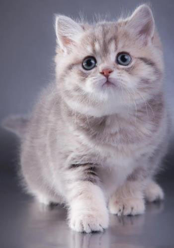
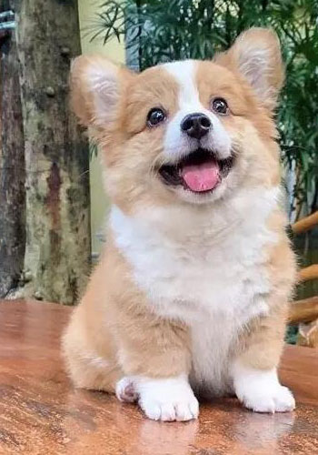

解决了若干报错后的工具函数包：
```python
import matplotlib.pyplot as plt
import numpy as np
import cv2
import pywt


# 灰度融合
def alphaBlend(x, y, A):
    return A * x + (1 - A) * y


def subtractBlend(x, y, A):
    new = (1 + A) * x - A * y
    return (new - new.min()) / (new.max() - new.min()) * 255


def multiplyBlend(x, y, A):
    new = x * (y + A * 255.0)
    return (new - new.min()) / (new.max() - new.min()) * 255


def multiplyBlend0(x, y, A):
    new = (x * (y + A * 255.0)) ** 2
    return (new - new.min()) / (new.max() - new.min()) * 255


def divideBlend(x, y, A):
    new = x / (y + A * 255 + 0.81)
    return (new - new.min()) / (new.max() - new.min()) * 255


def maxBlend(x, y, A):
    new = np.amax([(1 - A / 2) * x, (0.25 + A / 2) * y], axis=0)
    return (new - new.min()) / (new.max() - new.min()) * 255


def minBlend(x, y, A):
    new = np.amin([(1 - A / 2) * x, (0.25 + A / 2) * y], axis=0)
    return (new - new.min()) / (new.max() - new.min()) * 255


def multiplyBlend1(x, y, A):
    new = (
        x.astype(float)
        * y.astype(float)
        / (np.amax([(1 - A / 2) * x, (0.25 + A / 2) * y], axis=0) + 0.01)
    )
    return (new - new.min()) / (new.max() - new.min()) * 255


def multiplyBlend2(x, y, A):
    new = x * (255.0 - y + A * 255.0)
    return (new - new.min()) / (new.max() - new.min()) * 255


# 灰度变换
# 线性变换
def TwoSegment0(x, A, B, C):
    xcp = x.copy()
    xcp = np.where(x <= B, 127.0 * ((x - A) / (B - A + 0.0001)), xcp)
    xcp = np.where(x > B, 127.0 + 128.0 * ((x - B) / (C - B + 0.0001)), xcp)
    return np.clip(xcp, 0, 255)


def FourSegment0(x, A, B, C):
    # xcp = x.copy(x)
    # TypeError: order must be str, not numpy.ndarray
    xcp = x.copy()
    xcp = np.where(x <= A, 0.0 + 63.0 * ((x - 0) / (A - 0 + 0.0001)), xcp)
    xcp = np.where((x > A) & (x <= B), 63.0 + 64.0 * ((x - A) / (B - A + 0.0001)), xcp)
    xcp = np.where((x > B) & (x <= C), 127.0 + 64.0 * ((x - B) / (C - B + 0.0001)), xcp)
    xcp = np.where(x > C, 191.0 + 64.0 * ((x - C) / (255 - C + 0.0001)), xcp)
    return np.clip(xcp, 0, 255)


# 灰度融合RGB
def cvBGRBlend0(imData1, imData2, saveName, f=multiplyBlend, channel="rgb"):
    # 定义回调函数，比程序无需回调，所以Pass即可
    def callback(object):
        pass

    MAX_VALUE = 100  # 滑动条最大值
    MIN_VALUE = 0  # 滑动条最小值
    # if f == TwoSegment0: a0, b0, c0 = [0, 127, 255]
    # if f == FourSegment0: a0, b0, c0 = [63, 127, 191]
    a0 = 0
    cv2.namedWindow("cvAdjust", cv2.WINDOW_GUI_NORMAL)
    # cv2.resizewindow("resized", imData1.shape[0], imData1.shape[1])
    cv2.resizeWindow("cvAdjust", imData1.shape[1], imData1.shape[0])
    imData2 = cv2.resize(imData2, (imData1.shape[1], imData1.shape[0]))
    cv2.createTrackbar("a", "cvAdjust", MIN_VALUE, MAX_VALUE, callback)
    # cv2.createTrackbar("b", "cvAdjust", MIN_VALUE, MAX_VALUE, callback)
    # cv2.createTrackbar("c", "cvAdjust", MIN_VALUE, MAX_VALUE, callback)
    cv2.setTrackbarPos("a", "cvAdjust", a0)
    # cv2.setTrackbarPos("b", "cvAdjust", b0)
    # cv2.setTrackbarPos("c", "cvAdjust", c0)
    while True:
        A = cv2.getTrackbarPos("a", "cvAdjust") / 100.0
        # B = cv2.getTrackbarPos("b", "cvAdjust")
        # C = cv2.getTrackbarPos("c", "cvAdjust")
        b1, g1, r1 = cv2.split(imData1)
        b2, g2, r2 = cv2.split(imData2)
        if "b" in channel:
            b = f(b1, b2, A)
        if "g" in channel:
            g = f(g1, g2, A)
        if "r" in channel:
            r = f(r1, r2, A)
        imBGR = cv2.merge(np.uint8([b, g, r]))
        cv2.imshow("cvAdjust", imBGR)
        ch = cv2.waitKey(5)  # 按EsC键s键退出
        # if ch == 27 or ch == ord("s") or cv2.getwindowProperty("cvAdjust", 0) == -1:
        #     cv2.imwrite(saveName + "-Blended.jpg", imBGR)  # 保存图片并退出
        #     break
        if (
            ch == 27
            or ch == ord("s")
            or cv2.getWindowProperty("cvAdjust", cv2.WND_PROP_VISIBLE) == 0
        ):
            cv2.imwrite(saveName + "-Blended.jpg", imBGR)  # 保存图片并退出
            break
    cv2.destroyAllWindows()  # 关闭所有的窗口


# 灰度融合HSL
def cvHLSBlend0(imData1, imData2, saveName, f=multiplyBlend, channel="ls"):
    # 定义回调函数，比程序无需回调，所以Pass即可
    def callback(object):
        pass

    MAX_VALUE = 100  # 滑动条最大值
    MIN_VALUE = 0  # 滑动条最小值
    # if f == TwoSegment0: a0, b0, c0 = [0, 127, 255]
    # if f == FourSegment0: a0, b0, c0 = [63, 127, 191]
    a0 = 0
    cv2.namedWindow("cvAdjust", cv2.WINDOW_GUI_NORMAL)
    # cv2.resizewindow("resized", imData1.shape[0], imData1.shape[1])
    cv2.resizeWindow("cvAdjust", imData1.shape[1], imData1.shape[0])
    imData2 = cv2.resize(imData2, (imData1.shape[1], imData1.shape[0]))
    cv2.createTrackbar("a", "cvAdjust", MIN_VALUE, MAX_VALUE, callback)
    # cv2.createTrackbar("b", "cvAdjust", MIN_VALUE, MAX_VALUE, callback)
    # cv2.createTrackbar("c", "cvAdjust", MIN_VALUE, MAX_VALUE, callback)
    cv2.setTrackbarPos("a", "cvAdjust", a0)
    hls1 = cv2.cvtColor(imData1, cv2.COLOR_BGR2HLS)
    hls2 = cv2.cvtColor(imData2, cv2.COLOR_BGR2HLS)
    while True:
        A = cv2.getTrackbarPos("a", "cvAdjust") / 100.0
        # B = cv2.getTrackbarPos("b", "cvAdjust")
        # C = cv2.getTrackbarPos("c", "cvAdjust")
        b1, g1, r1 = cv2.split(hls1)
        b2, g2, r2 = cv2.split(hls2)
        if "h" in channel:
            b = f(b1, b2, A)
            b = np.mod(b, 180)  # 色相
        else:
            b = b2
        if "l" in channel:
            g = f(g1, g2, A)
        if "s" in channel:
            r = f(r1, r2, A)
        imBGR = cv2.cvtColor(cv2.merge(np.uint8([b, g, r])), cv2.COLOR_HLS2BGR)
        # HLS2BGR
        cv2.imshow("cvAdjust", imBGR)
        ch = cv2.waitKey(5)  # 按EsC键s键退出
        # if ch == 27 or ch == ord("s") or cv2.getwindowProperty("cvAdjust", 0) == -1:
        #     cv2.imwrite(saveName + "-Blended.jpg", imBGR)  # 保存图片并退出
        #     break
        if (
            ch == 27
            or ch == ord("s")
            or cv2.getWindowProperty("cvAdjust", cv2.WND_PROP_VISIBLE) == 0
        ):
            cv2.imwrite(saveName + "-Blended.jpg", imBGR)  # 保存图片并退出
            break
    cv2.destroyAllWindows()  # 关闭所有的窗口


# 灰度融合Lab
def cvLABBlend0(imData1, imData2, saveName, f=alphaBlend, channel="lab"):
    # 定义回调函数，比程序无需回调，所以Pa5s即可
    def callback(object):
        pass

    MAX_VALUE = 100  # 滑动条最大值
    MIN_VALUE = 0  # 滑动条最小值
    # if f == TwoSegment0: a0, b0, c0 = [0, 127, 255]
    # if f == FourSegment0: a0, b0, c0 = [63, 127, 191]
    a0 = 0
    cv2.namedWindow("cvAdjust", cv2.WINDOW_GUI_NORMAL)
    # cv2.resizewindow("resized",imData1.shape[0],imData1.shape[1])
    cv2.resizeWindow("cvAdjust", imData1.shape[1], imData1.shape[0])
    imData2 = cv2.resize(imData2, (imData1.shape[1], imData1.shape[0]))
    cv2.createTrackbar("a", "cvAdjust", MIN_VALUE, MAX_VALUE, callback)
    # cv2.createTrackbar("b", "cvAdjust", MIN_VALUE, MAX_VALUE, callback)
    # cv2.createTrackbar("c", "cvAdjust", MIN_VALUE, MAX_VALUE, callback)
    cv2.setTrackbarPos("a", "cvAdjust", a0)
    hls1 = cv2.cvtColor(imData1, cv2.COLOR_BGR2LAB)
    hls2 = cv2.cvtColor(imData2, cv2.COLOR_BGR2LAB)
    while True:
        A = cv2.getTrackbarPos("a", "cvAdjust") / 100.0
        # B = cv2.getTrackbarPos("b", "cvAdjust")
        # C = cv2.getTrackbarPos("c", "cvAdjust")
        b1, g1, r1 = cv2.split(hls1)
        b2, g2, r2 = cv2.split(hls2)
        if "l" in channel:
            b = f(b1, b2, A)
        if "a" in channel:
            g = f(g1, g2, A)
        if "b" in channel:
            r = f(r1, r2, A)
        imBGR = cv2.cvtColor(
            cv2.merge(np.uint8([b, g, r])), cv2.COLOR_LAB2BGR
        )  # HLS2BGR
        cv2.imshow("cvAdjust", imBGR)
        ch = cv2.waitKey(5)  # ESC 键s键退出
        # if ch == 27 or ch == ord("s") or cv2.getwindowProperty("cvAdjust", 0) == -1:
        #     cv2.imwrite(saveName + -"-Blended.jpg", imBGR)  # 保存图片并退出
        #     break
        if (
            ch == 27
            or ch == ord("s")
            or cv2.getWindowProperty("cvAdjust", cv2.WND_PROP_VISIBLE) == 0
        ):
            cv2.imwrite(saveName + "-Blended.jpg", imBGR)  # 保存图片并退出
            break
    cv2.destroyAllWindows()  # 关闭所有的窗口


# 频域融合
def spectrum_show(img, logarithm=True):  # 定义一个用于计算频谱图并显示的函数
    gray = np.expand_dims(img, axis=-1) if img.ndim == 2 else img
    f_img = np.zeros(gray.shape)
    for i in range(gray.shape[2]):
        fimg = np.fft.fft2(gray[:, :, i])  # 快速傅里叶变换算法得到频率分布
        fimg = np.fft.fftshift(fimg)  # 将图像中的低频部分移动到图像的中心，默认是在左上角
        fimg = np.abs(fimg)  # fft结果是复数，其绝对值结果是振幅
        # fimg np.angle(fshift) #相位
        f_img[:, :, i] = fimg
    if logarithm:
        f_img = np.log(1 + f_img)
    # 取对数的目的是使较小值也能显示
    f_img = f_img / np.amax(f_img)
    if img.ndim == 2:
        new_img = np.squeeze(f_img, -1)
    else:
        img = img[:, :, [2, 1, 0]]
        f_img = f_img[:, :, [2, 1, 0]]
    # print(np.amax(f_img),np.amin(f_img))
    # 展示结果
    plt.subplot(121), plt.imshow(img, "gray"), plt.title("Original Image")
    plt.axis("off")
    plt.subplot(122), plt.imshow(f_img, "gray"), plt.title("Fourier Image")
    plt.axis("off")
    plt.show()


# 频域融合
def cal_distance(pa, pb):  # 欧拉距离计算函数的定义
    return np.sqrt((pa[0] - pb[0]) ** 2 + (pa[1] - pb[1]) ** 2)


def IdealLowPass(dis, d, n):  # 理想低通滤波n为无效参数
    return np.where(dis > d, 0.0, 1.0)


def ButterworthLowPass(dis, d, n):  # 巴特沃斯低通滤波
    return 1 / (1 + (dis / d) ** (2.0 * n))


def GaussianLowPass(dis, d, n):  # 高斯低通滤波
    return np.exp(-(dis**2) / d**2 / 2)


def IdealhighPass(dis, d, n):  # 理想高通滤波n为无效参数
    return np.where(dis < d, 0.0, 1.0)


def ButterworthhighPass(dis, d, n):  # 巴特沃斯高通滤波
    return 1 / (1 + (d / dis) ** (2.0 * n))


def GaussianhighPass(dis, d, n):  # 高斯高通滤波
    return 1 - np.exp(-(dis**2) / d**2 / 2)


def GaussianhighPassEmphasize(dis, d, n):  # 高斯高通高频强调
    return 1 - np.exp(-(dis**2) / d**2 / 2) + 0.12


def _spectralBlend(fftImg1, fftImg2, f, d, n):
    nx, ny = fftImg1.shape[0], fftImg1.shape[1]
    pos_matrix = np.mgrid[0:nx, 0:ny]  # 位置
    center_point = tuple(map(lambda x: (x - 1) / 2, fftImg1.shape))  # 中心点
    dis = cal_distance(pos_matrix, center_point)
    passVal = f(dis, d, n)
    # spectrum_show(passval)
    return fftImg1 * passVal + (1 - passVal) * fftImg2


def spectralBlend(img1, img2, f=GaussianLowPass, d=25, n=5):
    # img=cv2.cvtColor(img,cv2.COLOR BGR2GRAY)
    gray1 = np.expand_dims(img1, axis=-1) if img1.ndim == 2 else img1
    gray2 = np.expand_dims(img1, axis=-1) if img2.ndim == 2 else img2
    new_img = np.zeros(gray1.shape)
    for i in range(gray1.shape[2]):
        fImg1 = np.fft.fft2(gray1[:, :, i])  # 快速傅里叶变换算法得到频率分布
        fImg1 = np.fft.fftshift(fImg1)  # 将图像中的低频部分移动到图像的中心，默认是在左上角
        fImg2 = np.fft.fft2(gray2[:, :, i])  # 快速傅里叶变换算法得到频率分布
        fImg2 = np.fft.fftshift(fImg2)  # 将图像中的低频部分移动到图像的中心，默认是在左上角
        fImg = _spectralBlend(fImg1, fImg2, f, d, n)
        new_img[:, :, i] = np.abs(np.fft.ifft2(np.fft.ifftshift(fImg)))  # 生成新图
    new_img = np.uint8(new_img / np.amax(new_img) * 255)
    if img1.ndim == 2:
        new_img = np.squeeze(new_img, -1)
    spectrum_show(new_img)
    return new_img


# 蒙版融合
def getMaskByf(img, d, n, f=GaussianLowPass):
    nx, ny = img.shape[0], img.shape[1]
    pos_matrix = np.mgrid[0:nx, 0:ny]
    # 位置
    center_point = tuple(map(lambda x: (x - 1) / 2, img.shape))  #
    center_point = (center_point[0] - 120, center_point[1] + 45)
    dis = cal_distance(pos_matrix, center_point + (30, -120))
    # passVal= f(dis,d,n)
    mask = f(dis, d, n)
    return mask


def getMaskBy0(img):
    nx, ny = img.shape[0], img.shape[1]
    mask = np.zeros((nx, ny))
    mask[0::2, 1::2] = 1
    mask[1::2, 0::2] = 1
    return mask


def maskBlend(img1, img2, mask=None, f=alphaBlend):
    gray1 = np.expand_dims(img1, axis=-1) if img1.ndim == 2 else img1
    gray2 = np.expand_dims(img2, axis=-1) if img2.ndim == 2 else img2
    new_img = np.zeros(gray1.shape)
    mask = getMaskByf(new_img, 120, 15)
    mask = getMaskBy0(new_img)
    spectrum_show(mask)
    for i in range(gray1.shape[2]):
        new_img[:, :, i] = f(gray1[:, :, i], gray2[:, :, i], mask)  # 生成新图
    new_img = np.uint8(new_img / np.amax(new_img) * 255)
    if img1.ndim == 2:
        new_img = np.squeeze(new_img, -1)
    spectrum_show(new_img)
    return new_img


# 频域复数分解融合
def _complexBlend(fftImg1, fftImg2):
    fftImg = fftImg1.real + 1j * fftImg2.imag
    absv = -np.abs(fftImg1)  # -np.abs(fftImg2)*1.5
    angle = np.angle(fftImg2)  # +np.angle(fftImg2)
    fftImg = absv * np.exp(1.0j * angle)
    # rows, cols = fftImg1.shape[0], fftImg1.shape[1]
    # fftImg = np.hstack((fftImg1[:, cols // 2], fftImg2[:, cols // 2 :]))
    return fftImg


def complexBlend(img1, img2):
    gray1 = np.expand_dims(img1, axis=-1) if img1.ndim == 2 else img1
    gray2 = np.expand_dims(img2, axis=-1) if img2.ndim == 2 else img2
    new_img = np.zeros(gray1.shape)
    for i in range(gray1.shape[2]):
        fImg1 = np.fft.fft2(gray1[:, :, i])  # 快速傅里叶变换算法得到频率分布
        fImg1 = np.fft.fftshift(fImg1)  # 将图像中的低频部分移动到图像的中心，默认是在左上角
        fImg2 = np.fft.fft2(gray2[:, :, i])  # 快速傅里叶变换算法得到频率分布
        fImg2 = np.fft.fftshift(fImg2)  # 将图像中的低频部分移动到图像的中心，默认是在左上角
        fImg = _complexBlend(fImg1, fImg2)
        new_img[::, i] = np.abs(np.fft.ifft2(np.fft.ifftshift(fImg)))  #
    new_img = np.uint8(new_img / np.amax(new_img) * 255)
    if img1.ndim == 2:
        new_img = np.squeeze(new_img, -1)
    spectrum_show(new_img)
    return new_img


# 直方图融合
def histBlend(img1, img2):
    gray1 = np.expand_dims(img1, axis=-1) if img1.ndim == 2 else img1
    gray2 = np.expand_dims(img2, axis=-1) if img2.ndim == 2 else img2
    new = np.zeros(gray1.shape)
    for i in range(gray1.shape[2]):
        mean1 = np.mean(gray1[:, :, i])
        std1 = np.std(gray1[:, :, i])
        mean2 = np.mean(gray2[:, :, i])
        std2 = np.std(gray2[:, :, i])
        new[:, :, i](gray1[:, :, i] - mean1) * (std2 / std1) ** 1.0 + mean2
    # new_img = np.uint8(((new - new.min()) / (new.max() - new.min())) * 255)
    # print(np.amax(new), np.amin(new))
    new_img = np.uint8(np.clip(new, 0, 255))
    if img1.ndim == 2:
        new_img = np.squeeze(new_img, -1)
    spectrum_show(new_img)
    return new_img


def histBlend_HLS(img1, img2):
    gray1 = np.expand_dims(img1, axis=-1) if img1.ndim == 2 else img1
    gray2 = np.expand_dims(img2, axis=-1) if img2.ndim == 2 else img2
    new = np.zeros(gray1.shape)
    gray1 = cv2.cvtColor(img1, cv2.COLOR_BGR2HLS)
    gray2 = cv2.cvtColor(img2, cv2.COLOR_BGR2HLS)
    new[:, i, 0] = gray1[:, :, 8]
    for i in [1, 2]:
        mean1 = np.mean(gray1[:, :, i])
        std1 = np.std(gray1[:, :, i])
        mean2 = np.mean(gray2[:, :, i])
        std2 = np.std(gray2[:, :, i])
        new[:, :, i](gray1[:, :, i] - mean1) * (std2 / std1) ** 1.0 + mean2
    # new_img = np.uint8(((new - new.min()) / (new.max() - new.min())) * 255)
    # print(np.amax(new), np.amin(new))
    new_img = np.uint8(np.clip(new, 0, 255))
    new_img = cv2.cvtColor(new_img, cv2.COLOR_HLS2BGR)
    if img1.ndim == 2:
        new_img = np.squeeze(new_img, -1)
    spectrum_show(new_img)
    return new_img


# 金字塔融合
def cv_show(image, message="crane"):
    cv2.imshow(message, image)
    cv2.waitKey(0)
    cv2.destroyAllWindows()


ksize = 7
sigma = 0.15 * ksize + 0.35
# print(sigma)


def build_gaussi_pyramid(high_res, layers):
    this_flash = [high_res]
    for i in range(1, layers):
        # 先对当前权重做高斯模糊，然后下采样3*sigma+1
        blurred = cv2.GaussianBlur(this_flash[i - 1], (ksize, ksize), sigma)
        blurred = blurred[::2, ::2]
        this_flash.append(blurred)
    return this_flash


# generated code
def build_laplacian_pyramaid(gaussi_pyramid, layers):
    laplacian_pyramid = []
    for i in range(layers - 1):
        # 当前层减去上一层上采样的结果
        size = (gaussi_pyramid[i].shape[1], gaussi_pyramid[i].shape[0])
        upsampled = cv2.resize(gaussi_pyramid[i + 1], size)
        laplacian = gaussi_pyramid[i] - upsampled
        laplacian_pyramid.append(laplacian)
    laplacian_pyramid.append(gaussi_pyramid[layers - 1])
    return laplacian_pyramid


def laplacian_fusion(sequence, layers_num=5, scale=2.0):
    # 转化成f1oat数据
    sequence = sequence / 255.0
    S = len(sequence)
    origin_fusion = sequence[0] * sequence[2] + sequence[1] * (1 - sequence[2])
    origin_fusion = np.uint8(origin_fusion * 255)
    results = {"naive": origin_fusion}
    blurredmask = cv2.GaussianBlur(sequence[2], (81, 81), 15)
    smoothed_fusion = np.uint8(
        (sequence[0] * blurredmask + sequence[1] * (1 - blurredmask)) * 255
    )
    results.update({"gaussi_smoothed": smoothed_fusion})
    # 求每张图的高斯金字塔，以求laplacian
    sequence_gaussi_pyramids = [
        build_gaussi_pyramid(sequence[s], layers_num) for s in range(S)
    ]
    # 求每张图的laplacian金字塔
    sequence_laplacian_pyramids = [
        build_laplacian_pyramaid(sequence_gaussi_pyramids[s], layers_num)
        for s in range(S)
    ]
    # 每一个尺度，融合一系列图像的的laplacian细节，得到一个融合的laplacian金字塔
    sequence_gaussi_pyramids[2][0] = cv2.GaussianBlur(
        sequence_gaussi_pyramids[2][0], (ksize, ksize), sigma
    )
    fused_laplacian_pyramid = [
        sequence_laplacian_pyramids[0][n] * sequence_gaussi_pyramids[2][n]
        + sequence_laplacian_pyramids[1][n] * (1 - sequence_gaussi_pyramids[2][n])
        for n in range(layers_num)
    ]
    # 先从最底层的图像开始，每次上采样都加上同等尺度的laplacian细节
    start = fused_laplacian_pyramid[layers_num - 1]
    for i in np.arange(layers_num):
        # cv2.imwrite(os.path.join(save_dir,"1f%d.png"%(i)),np.uint8(start 255),[cv2.IMWRITE_PNG_COMPRESSION,0])
        # cv2.imwrite(os.path.join(save_dir,"1fm%d.png"(i)),np.uint8(sequence_gaussi_pyramids[2][i]*255),[cv2.IMWRITE_PNG_COMPRESSION,0])
        pass
    for i in np.arange(layers_num - 2, -1, -1):
        upsampled = cv2.resize(
            start,
            (fused_laplacian_pyramid[i].shape[1], fused_laplacian_pyramid[i].shape[0]),
        )
        start = fused_laplacian_pyramid[i] + upsampled
    # 灰度值截断在0-255之间
    start = np.clip(start * 255, 0, 255).astype("uint8")
    # 放到结果列表中
    results.update({"laplacian_pyramid": start})
    return results


# #读取图片
# images_list= ['dlrb.jpg','palm.jpg','mask1.jpg']
# sequence =np.stack([cv2.imread(name)for name in images_list])
# #拉普拉斯融合
# fused_results= laplacian_fusion(sequence,layers_num=7)


# 泊松融合
# Read images src image will be cloned into dst
# obj=cv2.imread("dog.jpg")
# dst =cv2.imread("cat.jpg")
# mask= cv2.imread("mask.jpg")
# center=(205,125)

# obj = cv2.imread("dog.jpg")
# dst = cv2.imread("cat.jpg")
# mask = cv2.imread("maskd.jpg")
# center = (220, 150)

# mask[mask >128]=255
# mask[mask <=128]=0
# cv2.imwrite("maskd.jpg",mask)
# obj= np.uint8(obj*(mask/255.0)+255*(1-mask/255.0))

# The location of the center of the src in the dst
# width, height, channels = dst.shape

# center= (int(height/2),int(width/2))
# print(center)
# center=(220,150)
# center=(205,125)

# Seamlessly clone src into dst and put the results in output
# normal_clone = cv2.seamlessClone(obj, dst, mask, center, cv2.NORMAL_CLONE)
# mixed_clone = cv2.seamlessClone(obj, dst, mask, center, cv2.MIXED_CLONE)
# Write results
# cv2.imwrite("normal-clone.jpg", normal_clone)
# cv2.imwrite("mixed-clone.jpg", mixed_clone)


# 小波融合
def spectrum_show(img, logarithm=True):  # 定义一个用于计算频谱图并显示的函数
    gray = np.expand_dims(img, axis=-1) if img.ndim == 2 else img
    f_img = np.zeros(gray.shape)
    for i in range(gray.shape[2]):
        fimg = np.fft.fft2(gray[:, :, i])  # 快速傅里叶变换算法得到频率分布
        fimg = np.fft.fftshift(fimg)  # 将图像中的低频部分移动到图像的中心，默认是在左上角
        fimg = np.abs(fimg)  # 仟t结果是复数，其绝对值结果是振幅
    # fimg = np.angle(fshift)
    # 相位
    f_img[:, :, i] = fimg
    if logarithm:
        f_img = np.log(1 + f_img)
    # 取对数的目的是使较小值也能显示
    f_img = f_img / np.amax(f_img)
    if img.ndim == 2:
        new_img = np.squeeze(f_img, -1)
    else:
        img = img[:, :, [2, 1, 0]]
        f_img = f_img[:, :, [2, 1, 0]]
    # print(np.amax(f_img),np.amin(f_img))
    # 展示结果
    plt.subplot(121), plt.imshow(img, "gray"), plt.title("Original Image")
    plt.axis("off")
    plt.subplot(122), plt.imshow(f_img, "gray"), plt.title("Fourier Image")
    plt.axis("off")
    plt.show()


def fuseCoeff_mask(
    cooef1,
    cooef2,
    mask=None,
    method=None,
):
    if not mask is None:
        ksize = 5
        sigma = 0.15 * ksize + 0.35
        mask = cv2.resize(mask, (cooef1.shape[1], cooef1.shape[0]))
        mask = cv2.GaussianBlur(mask, (ksize, ksize), sigma)
    if method and ("grad" in method):
        ksize = 3
        sigma = 0.15 * ksize + 0.35
        grad1 = np.gradient(cooef1)
        grad1 = (grad1[0] ** 2 + grad1[1] ** 2) ** 0.5
        grad2 = np.gradient(cooef2)
        grad2 = (grad2[0] ** 2 + grad2[1] ** 2) ** 0.5
        # grad1 = cv2.GaussianBlur(grad1, (ksize, ksize), sigma)
        # grad2 = cv2.GaussianBlur(grad2, (ksize, ksize), sigma)
        maskg = np.where(grad1 > grad2, 1.0, 0.0)
        maskg = cv2.GaussianBlur(maskg, (ksize, ksize), sigma)
    if method == "mean":
        cooef2 = (cooef1 + cooef2) / 2
    elif method == "min":
        cooef2 = np.minimum(cooef1, cooef2)
    elif method == "max":
        cooef2 = np.maximum(cooef1, cooef2)
    elif method == "gradmax":
        cooef2 = cooef1 * maskg + cooef2 * (1 - maskg)
    elif method == "gradmin":
        cooef2 = cooef2 * maskg + cooef1 * (1 - maskg)
    else:
        pass
    return cooef2 * mask + cooef1 * (1 - mask) if not mask is None else cooef2


def mixed_pywtfuse_mask(
    obj, dst, mask=None, mixstart=2, l=5, w="haar", FUSION_METHOD="gradmax", c=1.1
):
    # w 小波基的类型 bior1.5 bior1.5 print(pywt,wavelist('db') l变换层次
    # ['haar','db','sym','coif','bior','rbio','dmey','gaus', 'mexh','morl','cgau','shan','fbsp','cmor']
    # FUSION METHOD 'gradmax'#None 'mean''max''min' 'gradmax' gradmin'mixed_METHOD 'high'    'low'
    dst = np.expand_dims(dst, axis=-1) if dst.ndim == 2 else dst
    obj = np.expand_dims(obj, axis=-1) if obj.ndim == 2 else obj
    new_img = np.zeros(dst.shape)
    if not mask is None:
        mask = mask[:, :, 0] / 255.0
    for i in [0, 1, 2]:
        cooef1 = pywt.wavedec2(dst[:, :, i], wavelet=w, level=l)  # 对图像进行小波分解
        cooef2 = pywt.wavedec2(obj[:, :, i], wavelet=w, level=l)  # 对图像进行小波分解
        fusedCooef = []
        for j in range(len(cooef1)):
            fm = FUSION_METHOD if j >= mixstart else None
            if j == 0:  # 顶层一幅图
                fusedCooef.append(fuseCoeff_mask(cooef1[0], cooef2[0], mask, fm))
                # fusedCooef.append(cooef1[0])
            else:  # 其他层三幅图
                c1 = fuseCoeff_mask(cooef1[j][0], cooef2[j][0], mask, fm) * c**j
                c2 = fuseCoeff_mask(cooef1[j][1], cooef2[j][1], mask, fm) * c**j
                c3 = fuseCoeff_mask(cooef1[j][2], cooef2[j][2], mask, fm) * c**j
                # 无法访问与值不关联的局部变量“c1”
                # print(c1, c2, c3)
                fusedCooef.append((c1, c2, c3))
        fused_img = pywt.waverec2(fusedCooef, wavelet=w)
        # if i == 0: fused_img = np.mod(fused_img, 180)
        new_img[:, :, i] = fused_img
    new_img = np.uint8(np.clip(new_img, 0, 255))
    if dst.ndim == 2:
        new_img = np.squeeze(new_img, -1)
    # print(new_img.shape)
    cv2.imwrite("pywt_fusion.jpg", new_img)
    return new_img
```

测试代码及部分结果：
```python
from util import *
import cv2

# 【1】选两张合适的图片，自定义mask，通过简单代数运算融合图片，融合可在HSL等颜色空间进行。需选择合适的代数运算，使得融合效果较好。
catImg = cv2.imread("./imgs/cat.jpg")
dogImg = cv2.imread("./imgs/dog.jpg")

# alphaBlend
# subtractBlend
# multiplyBlend
# multiplyBlend0
# divideBlend
# maxBlend
# minBlend
# multiplyBlend1
# multiplyBlend2
cvBGRBlend0(catImg, dogImg, "cvBGRBlend0-alphaBlend", f=alphaBlend)
cvBGRBlend0(catImg, dogImg, "cvBGRBlend0-subtractBlend", f=subtractBlend)
cvBGRBlend0(catImg, dogImg, "cvBGRBlend0-multiplyBlend", f=multiplyBlend)
cvBGRBlend0(catImg, dogImg, "cvBGRBlend0-multiplyBlend0", f=multiplyBlend0)
cvBGRBlend0(catImg, dogImg, "cvBGRBlend0-divideBlend", f=divideBlend)
cvBGRBlend0(catImg, dogImg, "cvBGRBlend0-maxBlend", f=maxBlend)
cvBGRBlend0(catImg, dogImg, "cvBGRBlend0-minBlend", f=minBlend)
cvBGRBlend0(catImg, dogImg, "cvBGRBlend0-multiplyBlend1", f=multiplyBlend1)
cvBGRBlend0(catImg, dogImg, "cvBGRBlend0-multiplyBlend2", f=multiplyBlend2)

cvBGRBlend0(dogImg, catImg, "cvBGRBlend0-alphaBlend-r", f=alphaBlend)
cvBGRBlend0(dogImg, catImg, "cvBGRBlend0-subtractBlend-r", f=subtractBlend)
cvBGRBlend0(dogImg, catImg, "cvBGRBlend0-multiplyBlend-r", f=multiplyBlend)
cvBGRBlend0(dogImg, catImg, "cvBGRBlend0-multiplyBlend0-r", f=multiplyBlend0)
cvBGRBlend0(dogImg, catImg, "cvBGRBlend0-divideBlend-r", f=divideBlend)
cvBGRBlend0(dogImg, catImg, "cvBGRBlend0-maxBlend-r", f=maxBlend)
cvBGRBlend0(dogImg, catImg, "cvBGRBlend0-minBlend-r", f=minBlend)
cvBGRBlend0(dogImg, catImg, "cvBGRBlend0-multiplyBlend1-r", f=multiplyBlend1)
cvBGRBlend0(dogImg, catImg, "cvBGRBlend0-multiplyBlend2-r", f=multiplyBlend2)

cvHLSBlend0(catImg, dogImg, "cvHLSBlend0-alphaBlend", f=alphaBlend)
cvHLSBlend0(catImg, dogImg, "cvHLSBlend0-subtractBlend", f=subtractBlend)
cvHLSBlend0(catImg, dogImg, "cvHLSBlend0-multiplyBlend", f=multiplyBlend)
cvHLSBlend0(catImg, dogImg, "cvHLSBlend0-multiplyBlend0", f=multiplyBlend0)
cvHLSBlend0(catImg, dogImg, "cvHLSBlend0-divideBlend", f=divideBlend)
cvHLSBlend0(catImg, dogImg, "cvHLSBlend0-maxBlend", f=maxBlend)
cvHLSBlend0(catImg, dogImg, "cvHLSBlend0-minBlend", f=minBlend)
cvHLSBlend0(catImg, dogImg, "cvHLSBlend0-multiplyBlend1", f=multiplyBlend1)
cvHLSBlend0(catImg, dogImg, "cvHLSBlend0-multiplyBlend2", f=multiplyBlend2)

cvLABBlend0(catImg, dogImg, "cvLABBlend0-alphaBlend", f=alphaBlend)
cvLABBlend0(catImg, dogImg, "cvLABBlend0-subtractBlend", f=subtractBlend)
cvLABBlend0(catImg, dogImg, "cvLABBlend0-multiplyBlend", f=multiplyBlend)
cvLABBlend0(catImg, dogImg, "cvLABBlend0-multiplyBlend0", f=multiplyBlend0)
cvLABBlend0(catImg, dogImg, "cvLABBlend0-divideBlend", f=divideBlend)
cvLABBlend0(catImg, dogImg, "cvLABBlend0-maxBlend", f=maxBlend)
cvLABBlend0(catImg, dogImg, "cvLABBlend0-minBlend", f=minBlend)
cvLABBlend0(catImg, dogImg, "cvLABBlend0-multiplyBlend1", f=multiplyBlend1)
cvLABBlend0(catImg, dogImg, "cvLABBlend0-multiplyBlend2", f=multiplyBlend2)
```

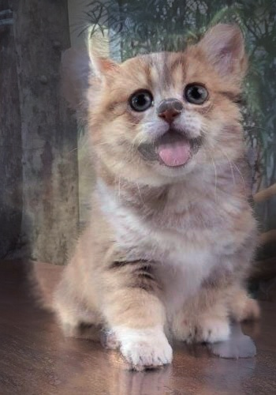

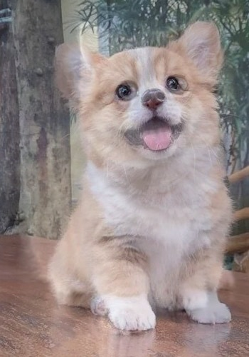

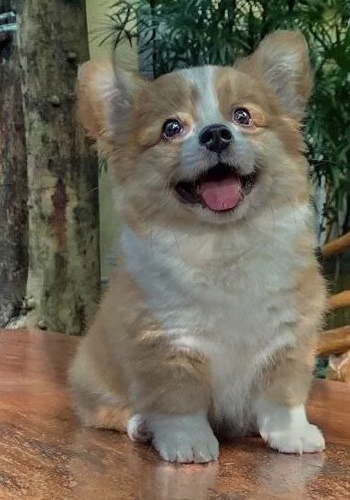
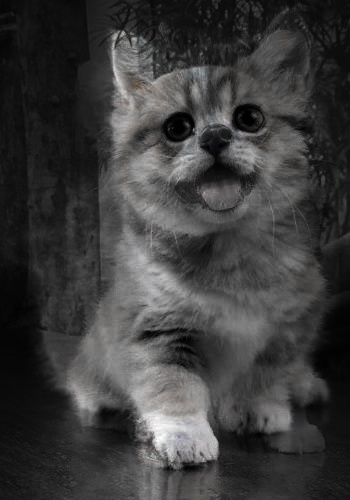
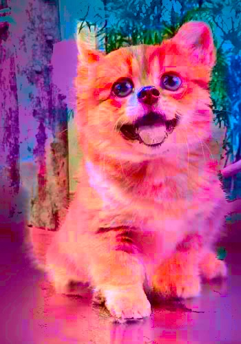
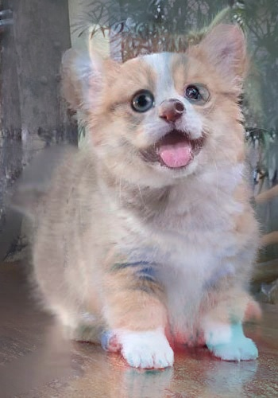
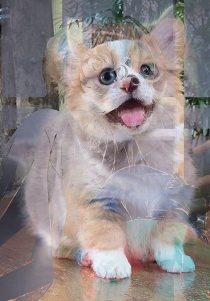
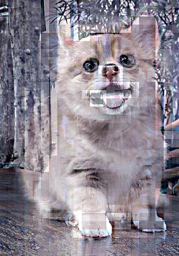

更多结果见"./*.jpg"
```
cvBGRBlend0-alphaBlend-Blended.jpg
cvBGRBlend0-alphaBlend-r-Blended.jpg
cvBGRBlend0-divideBlend-Blended.jpg
cvBGRBlend0-divideBlend-r-Blended.jpg
cvBGRBlend0-maxBlend-Blended.jpg
cvBGRBlend0-maxBlend-r-Blended.jpg
cvBGRBlend0-minBlend-Blended.jpg
cvBGRBlend0-minBlend-r-Blended.jpg
cvBGRBlend0-multiplyBlend-Blended-1.jpg
cvBGRBlend0-multiplyBlend-Blended.jpg
cvBGRBlend0-multiplyBlend-r-Blended.jpg
cvBGRBlend0-multiplyBlend0-Blended.jpg
cvBGRBlend0-multiplyBlend0-r-Blended.jpg
cvBGRBlend0-multiplyBlend1-Blended.jpg
cvBGRBlend0-multiplyBlend1-r-Blended.jpg
cvBGRBlend0-multiplyBlend2-Blended.jpg
cvBGRBlend0-multiplyBlend2-r-Blended.jpg
cvBGRBlend0-subtractBlend-Blended.jpg
cvBGRBlend0-subtractBlend-r-Blended.jpg
cvHLSBlend0-alphaBlend-Blended.jpg
cvHLSBlend0-divideBlend-Blended.jpg
cvHLSBlend0-maxBlend-Blended.jpg
cvHLSBlend0-minBlend-Blended.jpg
cvHLSBlend0-multiplyBlend-Blended.jpg
cvHLSBlend0-multiplyBlend0-Blended.jpg
cvHLSBlend0-multiplyBlend1-Blended.jpg
cvHLSBlend0-multiplyBlend2-Blended.jpg
cvHLSBlend0-subtractBlend-Blended.jpg
cvLABBlend0-alphaBlend-Blended.jpg
cvLABBlend0-divideBlend-Blended.jpg
cvLABBlend0-maxBlend-Blended.jpg
cvLABBlend0-minBlend-Blended.jpg
cvLABBlend0-multiplyBlend-Blended.jpg
cvLABBlend0-multiplyBlend0-Blended.jpg
cvLABBlend0-multiplyBlend1-Blended.jpg
cvLABBlend0-multiplyBlend2-Blended.jpg
cvLABBlend0-subtractBlend-Blended.jpg
gaussi_smoothed.jpg
gaussi_smoothed1.jpg
gaussi_smoothed4.jpg
gaussi_smoothed7.jpg
gaussi_smoothed31.jpg
gaussi_smoothed61.jpg
gaussi_smoothed91.jpg
laplacian_pyramid.jpg
laplacian_pyramid1.jpg
laplacian_pyramid4.jpg
laplacian_pyramid7.jpg
laplacian_pyramid31.jpg
laplacian_pyramid61.jpg
laplacian_pyramid91.jpg
naive.jpg
naive1.jpg
naive4.jpg
naive7.jpg
naive31.jpg
naive61.jpg
naive91.jpg
pywt_fusion.jpg
```

图像频谱图：
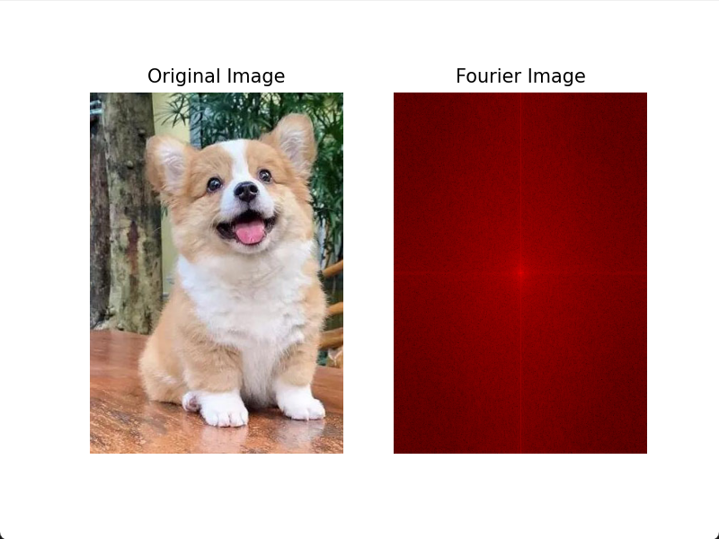
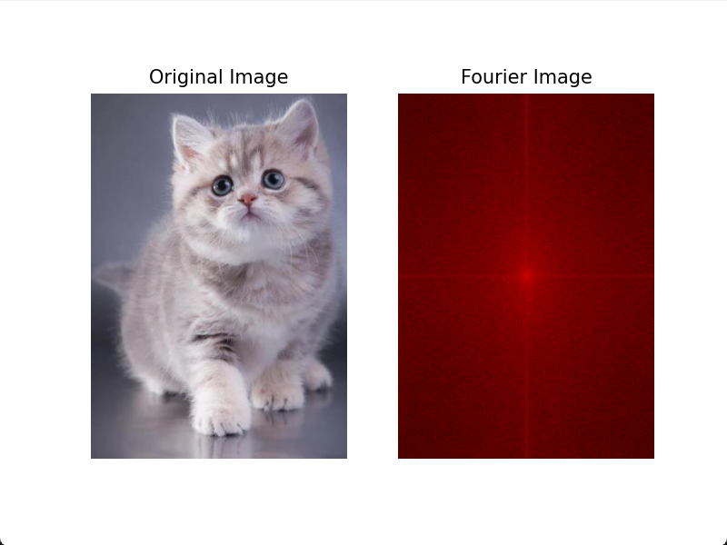

在HSL颜色空间中，我们可以通过调整色调（Hue）、饱和度（Saturation）和亮度（Lightness）来改变图像的颜色。我们可以选择将两张图片的色调、饱和度和亮度进行加权平均，以实现融合效果。

在选择代数运算时，我们可以尝试不同的权重分配方法，例如使用线性插值或者根据像素值的大小进行加权平均。通过多次尝试和比较，我们可以找到一种合适的代数运算方法，使得融合效果较好。

之后将实验【1】的图片通过拉普拉斯金字塔分解进行了多分辨率融合。拉普拉斯金字塔是一种常用的图像分解方法，可以将图像分解为不同分辨率的子图。

首先，我们对原始图像进行高斯模糊处理，以降低图像的噪声。然后，我们使用拉普拉斯算子对图像进行卷积操作，得到拉普拉斯金字塔的底层图像。接下来，我们对底层图像进行上采样操作，以得到与原始图像相同大小的图像。最后，我们将上采样后的图像与原始图像进行叠加，得到融合后的图像。

通过多次迭代上述过程，我们可以逐步提高融合效果。最终，我们可以得到一个具有更好细节和清晰度的融合图像。

最后将实验【1】的图片通过泊松融合方法进行了融合。泊松融合是一种基于图像统计信息的融合方法，可以有效地保留图像的细节信息。

首先，我们对原始图像进行泊松融合参数的估计。泊松融合参数包括平滑因子和权重因子，用于控制融合效果和保留细节的程度。我们可以通过计算图像的梯度信息来估计这些参数。

然后，我们使用估计得到的参数对原始图像进行泊松融合操作。具体地，我们将原始图像与目标图像进行加权平均，其中权重因子根据泊松分布来确定。这样，我们可以有效地保留原始图像的细节信息，并减少融合过程中的失真。

通过多次迭代上述过程，我们可以逐步提高融合效果。最终，我们可以得到一个具有较好细节保留和清晰度的融合图像。
