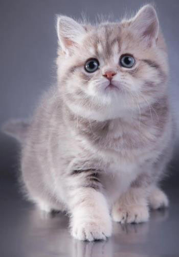
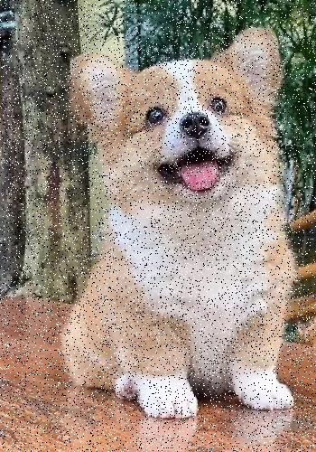

计算机视觉的图像修复是指通过算法和技术手段对受损或受到噪声污染的图像进行恢复和改善的过程。图像修复在许多应用领域都有重要的作用，包括数字摄影、医学影像、监控系统等。
本次实验相关名词：
- 噪声模拟（Noise Simulation）：噪声是图像中常见的干扰因素之一，例如高斯噪声、椒盐噪声等。噪声模拟是通过向原始图像添加已知类型和参数的噪声来模拟真实世界中的噪声情况。这样可以帮助研究人员评估和比较不同的图像修复算法的性能。
- 统计排序滤波（Statistical Order Filtering）：统计排序滤波是一种基于排序统计理论的图像去噪方法。它通过对局部区域内的像素值进行排序，然后根据排序结果进行像素值的更新。常见的统计排序滤波器包括中值滤波器、最大值滤波器和最小值滤波器等。这些滤波器能够有效地去除图像中的噪声，并保持图像的边缘信息。
- 退化模拟（Degradation Simulation）：退化模拟是指通过模拟图像在损坏、变形或降质过程中的特性，来研究和设计图像修复算法。例如，模拟图像在传感器噪声、运动模糊或光照变化等因素下的退化情况，可以帮助研究人员更好地理解和处理真实世界中的图像问题。
- 维纳滤波（Wiener Filtering）：维纳滤波是一种经典的图像恢复方法，它基于信号处理和统计学原理。维纳滤波器通过对图像进行频域分析，并根据图像的功率谱和噪声功率谱之间的关系，对图像进行滤波和恢复。维纳滤波器能够有效地减少噪声，并保持图像的细节信息。
- BSCB算法（Block-Based Sparse and Collaborative Representation）：BSCB算法是一种基于稀疏表示理论的图像修复方法。它将图像分成若干个重叠的小块，然后利用稀疏表示模型对每个小块进行重建。BSCB算法通过引入稀疏性和协作性的约束，能够有效地恢复受损图像的细节和结构。

本次实验选用下面的一些图片：



解决了若干报错后的工具函数包：
```python
import cv2
import matplotlib.pyplot as plt
import numpy as np
import scipy


# 高斯噪声
def normalize(mask, cut=True):
    if cut:
        return np.clip(mask, 0, 255) / 255.0
    return (mask - mask.min()) / (mask.max() - mask.min())


def add_gaussian_noise(img, mu=0, sigma=25):
    img = np.expand_dims(img, axis=-1) if img.ndim == 2 else img
    new_img = np.zeros(img.shape)
    for i in range(img.shape[2]):
        image = np.array(img[:, :, i], dtype=float)
        noise = np.random.normal(mu, sigma, image.shape)
        # print(np.mean(noise), np.std(noise))
        new_img[:, :, i] = normalize(image + noise) * 255
    if img.ndim == 2:
        new_img = np.squeeze(new_img, -1)
    return np.uint8(new_img)


# 瑞利噪声
def add_rayleigh_noise(img, mu=0, sigma=25):
    img = np.expand_dims(img, axis=-1) if img.ndim == 2 else img
    new_img = np.zeros(img.shape)
    for i in range(img.shape[2]):
        image = np.array(img[:, :, i], dtype=float)
        noise = np.random.rayleigh(scale=sigma, size=image.shape)
        noise = noise / np.std(noise) * sigma
        noise = noise - np.mean(noise) + mu
        # print(np.mean(noise), np.std(noise))
        new_img[:, :, i] = normalize(image + noise) * 255
        if img.ndim == 2:
            new_img = np.squeeze(new_img, -1)
    return np.uint8(new_img)


# 伽马噪声
def add_gamma_noise(img, mu=0, sigma=25):
    img = np.expand_dims(img, axis=-1) if img.ndim == 2 else img
    new_img = np.zeros(img.shape)
    for i in range(img.shape[2]):
        image = np.array(img[:, :, i], dtype=float)
        a = 2 * mu - np.sqrt(12 * sigma)
        b = 2 * mu + np.sqrt(12 * sigma)
        noise = np.random.uniform(a, b, image.shape)
        # showGrayHist(noise)
        # print(np.mean(noise), np.std(noise))
        # print(b*scale, b**0.5*scale)
        new_img[:, :, i] = normalize(image + noise) * 255
    if img.ndim == 2:
        new_img = np.squeeze(new_img, -1)
    return np.uint8(new_img)


# 椒盐噪声
def add_salt_pepper(img, ps=0.05, pp=0.05):
    img = np.expand_dims(img, axis=-1) if img.ndim == 2 else img
    new_img = np.zeros(img.shape)
    h, w = img.shape[:2]
    mask = np.random.choice((0, 0.5, 1), size=(h, w), p=[pp, (1 - pp - ps), ps])
    img_out = img
    img_out[mask == 1] = 255
    img_out[mask == 0] = 0
    new_img = img_out
    if img.ndim == 2:
        new_img = np.squeeze(new_img, -1)
    return np.uint8(new_img)


# 几何均值滤波
def GeometricMeanOperator(roi):
    roi = roi.astype(np.float64)
    p = np.prod(roi)
    return p ** (1 / (roi.shape[0] * roi.shape[1]))


def GeometricMeanAlogrithm(image):
    # 几何均值滤波
    new_image = np.zeros(image.shape)
    image = cv2.copyMakeBorder(image, 1, 1, 1, 1, cv2.BORDER_DEFAULT)
    for i in range(1, image.shape[0] - 1):
        for j in range(1, image.shape[1] - 1):
            new_image[i - 1, j - 1] = GeometricMeanOperator(
                image[i - 1 : i + 2, j - 1 : j + 2]
            )
    new_image = (new_image - np.min(image)) * (255 / np.max(image))
    return new_image.astype(np.uint8)


def rgbGemoetricMean(image):
    r, g, b = cv2.split(image)
    r = GeometricMeanAlogrithm(r)
    g = GeometricMeanAlogrithm(g)
    b = GeometricMeanAlogrithm(b)
    return cv2.merge([r, g, b])


# 谐波均值滤波
def HarmonicMeanOperator(roi):
    roi = roi.astype(np.float64)
    if 0 in roi:
        roi = 0
    else:
        roi = scipy.stats.hmean(roi.reshape(-1))
    return roi


def HarmonicMeanAlogrithm(image):
    # 谐波均值滤波
    new_image = np.zeros(image.shape)
    image = cv2.copyMakeBorder(image, 1, 1, 1, 1, cv2.BORDER_DEFAULT)
    for i in range(1, image.shape[0] - 1):
        for j in range(1, image.shape[1] - 1):
            new_image[i - 1, j - 1] = HarmonicMeanOperator(
                image[i - 1 : i + 2, j - 1 : j + 2]
            )
    new_image = (new_image - np.min(image)) * (255 / np.max(image))
    return new_image.astype(np.uint8)


def rgbHarmonicMean(image):
    r, g, b = cv2.split(image)
    r = HarmonicMeanAlogrithm(r)
    g = HarmonicMeanAlogrithm(g)
    b = HarmonicMeanAlogrithm(b)
    return cv2.merge([r, g, b])


# 逆谐波均值滤波
def Contra_harmonicMeanOperator(roi, q):
    roi = roi.astype(np.float64)
    return np.mean(roi ** (q + 1)) / np.mean((roi) ** (q))


def Contra_harmonicMeanAlogrithm(image, q):
    # 逆谐波均值滤波
    new_image = np.zeros(image.shape)
    image = cv2.copyMakeBorder(image, 1, 1, 1, 1, cv2.BORDER_DEFAULT)
    for i in range(1, image.shape[0] - 1):
        for j in range(1, image.shape[1] - 1):
            new_image[i - 1, j - 1] = Contra_harmonicMeanOperator(
                image[i - 1 : i + 2, j - 1 : j + 2], q
            )
    new_image = (new_image - np.min(image)) * (255 / np.max(image))
    return new_image.astype(np.uint8)


def rgbContra_harmonicMean(image, q):
    r, g, b = cv2.split(image)
    r = Contra_harmonicMeanAlogrithm(r, q)
    g = Contra_harmonicMeanAlogrithm(g, q)
    b = Contra_harmonicMeanAlogrithm(b, q)
    return cv2.merge([r, g, b])


# 图像退化恢复
# 仿真运动模糊
def get_motion_dsf(image_sise, motion_angle, motion_dis):
    PSF = np.zeros(image_sise)  # 点扩散函数
    x_center = (image_sise[0] - 1) / 2
    y_center = (image_sise[1] - 1) / 2
    sin_val = np.sin(motion_angle * np.pi / 180)
    cos_val = np.cos(motion_angle * np.pi / 180)
    # 将对应角度上motion_dis个点置成1
    for i in range(motion_dis):
        x_offset = round(sin_val * i)
        y_offset = round(cos_val * i)
        PSF[int(x_center - x_offset), int(y_center + y_offset)] = 1
    return PSF / PSF.sum()  # 归一化


# 仿真湍流模糊
def cal_distance(pa, pb):  # 欧拉距离计算函数的定义
    return np.sqrt((pa[0] - pb[0]) ** 2 + (pa[1] - pb[1]) ** 2)


def get_turbulence_dsf(image_sise, k=0.1):
    center_point = tuple(map(lambda x: (x - 1) / 2, image_sise))  # 中心点
    pos_matrix = np.mgrid[0 : image_sise[0], 0 : image_sise[1]]  # 生成位置矩阵
    dis = cal_distance(pos_matrix, center_point)  # 计算距离矩阵
    # PSF_fft = dis
    PSF_fft = np.exp(-k * (dis ** (5 / 6)))  # 点扩散函数 fft
    PSF = np.fft.ifft2(PSF_fft)  # image FFT multiplly PSF FFT
    PSF = np.abs(np.fft.ifftshift(PSF))  # 中心化
    return PSF / PSF.sum()  # 归一化


# 图像退化恢复
# 对图片继续模糊
def make_blurred(img, PSF, eps):
    img = np.expand_dims(img, axis=-1) if img.ndim == 2 else img
    new_img = np.zeros(img.shape)
    for i in range(img.shape[2]):
        input_fft = np.fft.fft2(img[:, :, i])
        PSF_fft = np.fft.fft2(PSF) + eps
        blurred = np.fft.ifft2(input_fft * PSF_fft)
        blurred = np.abs(np.fft.ifftshift(blurred))
        new_img[:, :, i] = blurred
    if img.ndim == 2:
        new_img = np.squeeze(new_img, -1)
    return np.uint8(new_img)


def inverse_filter(img, PSF, eps):
    img = np.expand_dims(img, axis=-1) if img.ndim == 2 else img
    new_img = np.zeros(img.shape)
    for i in range(img.shape[2]):
        input_fft = np.fft.fft2(img[:, :, i])
        PSF_fft = np.fft.fft2(PSF) + eps
        result = np.fft.ifft2(input_fft / PSF_fft)
        result = np.abs(np.fft.ifftshift(result))
        new_img[:, :, i] = result
    if img.ndim == 2:
        new_img = np.squeeze(new_img, -1)
    return np.uint8(new_img)


def wiener_filter(img, PSF, eps, K=0.01):
    img = np.expand_dims(img, axis=-1) if img.ndim == 2 else img
    new_img = np.zeros(img.shape)
    for i in range(img.shape[2]):
        input_fft = np.fft.fft2(img[:, :, i])
        PSF_fft = np.fft.fft2(PSF) + eps
        PSF_fft_1 = np.conj(PSF_fft) / (np.abs(PSF_fft) ** 2 + K)
        result = np.fft.ifft2(input_fft * PSF_fft_1)
        result = np.abs(np.fft.ifftshift(result))
        new_img[:, :, i] = result
    if img.ndim == 2:
        new_img = np.squeeze(new_img, -1)
    return np.uint8(new_img)


def spectrum_show(PSF, title):
    PSF_fft = np.fft.fft2(PSF)
    PSF_fft_shift = np.fft.fftshift(PSF_fft)
    spectrum = 20 * np.log(np.abs(PSF_fft_shift))
    plt.imshow(spectrum, cmap="gray")
    plt.title(title)
    plt.axis("off")
    plt.show()


# 图像修补BSCB
def normalize(mask, cut=False):
    if cut:
        return np.clip(mask, 0, 255) / 255.0
    return (mask - mask.min()) / (mask.max() - mask.min())


# BSCB https://www.cnblogs.com/jgg54335/p/14561720.html


def BSCB_inpaint(
    pic_array,
    mask=None,
    epsilon=0.1,
    inpaint_iters=6,
    anidiffuse_iters=6,
    delta_ts=0.02,
    sensitivites=100,
    diffuse_coef=1,
):
    # BSCB算法
    pic_copy = pic_array.copy()
    # epsilon2 = epsilon ** 2
    epsilon2 = epsilon * epsilon
    pic_copy_ = pic_array.copy()
    for i in range(anidiffuse_iters):  # 执行各向异性扩散
        dx_dy = np.gradient(pic_copy)  # 计算梯度
        grad_norm = (
            dx_dy[0] ** 2 + dx_dy[1] ** 2 + epsilon2
        ) ** 0.5  # epsilon2是为了防止分母为0
        if diffuse_coef == 0:
            diffuse_coefs = np.exp(-grad_norm / sensitivites)
        else:
            diffuse_coefs = 1 / (1 + grad_norm / sensitivites)
        dxx = np.gradient(dx_dy[0], axis=0)
        dyy = np.gradient(dx_dy[1], axis=1)
        laplacian = dxx + dyy
        if not mask is None:
            diffuse_coefs = diffuse_coefs * mask
        pic_copy = pic_copy + diffuse_coefs * laplacian
    for i in range(inpaint_iters):  # 执行修补
        dx_dy = np.gradient(pic_copy)  # 计算梯度
        grad_norm = (dx_dy[0] ** 2 + dx_dy[1] ** 2 + epsilon2) ** 0.5
        dxx = np.gradient(dx_dy[0], axis=0)
        dyy = np.gradient(dx_dy[1], axis=1)
        laplacian = dxx + dyy
        dx_dy_ = np.gradient(laplacian)
        if not mask is None:
            delta_ts = delta_ts * mask
        delta_ts = delta_ts * (grad_norm > 0)
        pic_copy = (
            pic_copy
            - delta_ts * (-dx_dy[0] * dx_dy_[0] + dx_dy[1] * dx_dy_[1]) / grad_norm
        )
    # import time
    # timestamp = time.time()
    # print("time:", timestamp)
    # cv2.imwrite(str(timestamp) + ".jpg", img=np.uint8(pic_copy * 255))
    pic_new = pic_array.copy()
    pic_new[1:-1, 1:-1] = pic_copy[1:-1, 1:-1]  # 更新
    return pic_new


def gen_pic_with_mask(mask, origin_pic):
    origin_pic[mask == 1.0] = 128
    return origin_pic


# 图像修补TV
def normalize(mask, cut=False):
    if cut:
        return np.clip(mask, 0, 255) / 255.0
    return (mask - mask.min()) / (mask.max() - mask.min())


# TV https://www.cnblogs.com/hxjbc/p/6675901.html


def tv_inpaint(pic_array, mask=None, epsilon=0.1, dt=0.1, lambda_=0.1, withCCD=True):
    # tv算法
    pic_copy = pic_array.copy()
    epsilon2 = epsilon * epsilon
    # 求梯度
    dx_dy = np.gradient(pic_copy)
    dx_dy = dx_dy / (dx_dy[0] ** 2 + dx_dy[1] ** 2 + epsilon2) ** 0.5
    # 求散度 divergence(zx, zy) = zx_x + zy_y
    dxx = np.gradient(dx_dy[0], axis=0)
    dyy = np.gradient(dx_dy[1], axis=1)
    div = dxx + dyy
    if withCCD:  # 是否曲率驱动
        k = np.abs(div)
        k = k / np.max(k) / dt
        k = 0.3 + 0.7 * k**0.1
        div = div * k
    if not mask is None:
        div = div * mask
    # 迭代求解
    pic_copy = pic_copy + dt * div - lambda_ * (pic_copy - pic_array)
    pic_new = pic_array.copy()
    pic_new[1:-1, 1:-1] = pic_copy[1:-1, 1:-1]  # 更新
    return pic_new


def gen_pic_with_mask(mask, origin_pic):
    origin_pic[mask == 1.0] = 128
    return origin_pic
```

示例代码：
```python
# 显示原图像
plt.figure(1, figsize=(6, 6))
plt.title('Original Image'), plt.imshow(image[..., [2, 1, 0]], 'gray')
plt.xticks([]), plt.yticks([])


# 进行模糊处理
PSF = get_motion_dsf(image.shape[:2], -50, 100)
PSF = get_turbulence_dsf(image.shape[:2])
spectrum_show(PSF, title='PSF Image')  # 模糊PSF与谱
blurred = make_blurred(image, PSF, 1e-3)
plt.figure(2, figsize=(8, 8))
plt.subplot(231), plt.imshow(
    blurred[..., [2, 1, 0]], 'gray'), plt.title('blurred')
plt.xticks([]), plt.yticks([])

# 逆滤波
result = inverse_filter(blurred, PSF, 1e-3)
plt.subplot(232), plt.imshow(
    result[..., [2, 1, 0]], 'gray'), plt.title('inverse deblurred')
plt.xticks([]), plt.yticks([])

# 维纳滤波
result = wiener_filter(blurred, PSF, 1e-3)
plt.subplot(233), plt.imshow(result[..., [2, 1, 0]], 'gray'), plt.title(
    'wiener deblurred(K=0.01)')
plt.xticks([]), plt.yticks([])

# 添加噪声,standard_normal产生随机的函数
blurred_noisy = np.uint8(blurred + 0.1*blurred.std()
                         * np.random.standard_normal(blurred.shape))

# 显示添加噪声且模糊的图像
plt.subplot(234), plt.imshow(
    blurred_noisy[..., [2, 1, 0]], 'gray'), plt.title('blurred and noisy')

# 对添加噪声的图像进行逆滤波
result = inverse_filter(blurred_noisy, PSF, 0.1+1e-3)
plt.subplot(235), plt.imshow(
    result[..., [2, 1, 0]], 'gray'), plt.title('inverse deblurred')
plt.xticks([]), plt.yticks([])

# 对添加噪声的图像进行维纳滤波
result = wiener_filter(blurred_noisy, PSF, 0.1+1e-3)
plt.subplot(236), plt.imshow(result[..., [2, 1, 0]], 'gray'), plt.title(
    'wiener deblurred(k=0.01)')
plt.xticks([]), plt.yticks([])

plt.tight_layout()
plt.savefig('out.jpg', format='jpg', bbox_inches='tight', dpi=96)
plt.show()


# ----------------------------------------------

img = cv2.imread('dog_defiled.jpg')
# 图片二值化处理，把[0, 0, 200]~[70, 70, 255] 以外的颜色变成0
thresh = cv2.inRange(img, np.array([0, 0, 200]), np.array([70, 70, 255]))
# 创建形状和尺寸的结构元素
kernel = np.ones((3, 3), np.uint8)
# 扩张待修复区域
mask = cv2.dilate(thresh, kernel, iterations=1)/255.0
specturm_show(mask)

pic = gen_pic_with_mask(mask, img)

epsilon = 0.1
inpaint_iters = 6
anidiffuse_iters = 6
delta_ts = 0.2
sensitivites = 100
diffuse_coef = 1

epochs = 201
pic = (pic/255.0).astype(np.float)
pic_copy = np.zeros(pic.shape)
for epoch in range(epochs):
    # 每epochs次显示一次数据，保存一次数据
    if epoch % 40 == 0:
        print('epoch,当前的循环次数：', epoch, np.abs(pic-pic_copy).max())
        cv2.imwrite('dog_filed'+str(epoch)+'.jpg', img=np.uint8(pic*255))
    pic_copy = pic.copy()
    if epoch < epoch-1:
        for i in range(3):
            pic[:, :, i] = BSCB_inpaint(pic_copy[:, :, i], mask=mask,
                                        epsilon=epsilon, inpaint_iters=inpaint_iters, anidiffuse_iters=anidiffuse_iters, delta_ts=delta_ts,
                                        sensitivites=sensitivites, diffuse_coef=diffuse_coef)
pic = np.uint8(pic*255)
specturm_show(pic)

# ----------------------------------------------


img = cv2.imread('dog_defiled.jpg')
# 图片二值化处理，把[240, 240, 240]~[255, 255, 255] 以外的颜色变成0
thresh = cv2.inRange(img, np.array([0, 0, 200]), np.array([70, 70, 255]))
# 创建形状和尺寸的结构元素
kernel = np.ones((3, 3), np.uint8)
# 扩张待修复区域
mask = cv2.dilate(thresh, kernel, iterations=1)/255.0
specturm_show(mask)

pic = gen_pic_with_mask(mask, img)

epsilon = 0.1
dt = 0.1
lambda_ = 0.1
epochs = 601
pic = (pic/255.0).astype(np.float)
pic_copy = np.zeros(pic.shape)

for epoch in range(epochs):
    # 每epochs次显示一次数据，保存一次数据
    if epoch % 100 == 0:
        print('epoch,当前的循环次数：', epoch, np.abs(pic-pic_copy).max())
        cv2.imwrite('dog_filed'+str(epoch)+'.jpg', img=np.uint8(pic*255))
    pic_copy = pic.copy()
    if epoch < epoch-1:
        for i in range(3):
            pic[:, :, i] = tv_inpaint(pic_copy[:, :, i], mask=mask,
                                      epsilon=epsilon, dt=dt, lambda_=lambda_)
pic = np.uint8(pic*255)
specturm_show(pic)


# 图像修补NS、FMM
img = cv2.imread('dog_defiled.jpg')
# 图片二值化处理，把[240, 240, 240]~[255, 255, 255] 以外的颜色变成0
thresh = cv2.inRange(img, np.array([0, 0, 200]), np.array([70, 70, 255]))
# 创建形状和尺寸的结构元素
kernel = np.ones((3, 3), np.uint8)
# 扩张待修复区域
mask = cv2.dilate(thresh, kernel, iterations=1)
specturm_show(mask)

out = cv2.inpaint(img, mask, inpaintRadius=-1, flags=cv2.INPAINT_TELEA)

specturm_show(out)
cv2.imshow('dog_mask.jpg', mask)
cv2.imwrite('dog_filed.jpg', out)

# 图像修补PatchMatch
```


首先对图片进行噪声模拟，这里分别对两张图片进行四种不同的噪声模拟，分别是高斯噪声、瑞利噪声、伽马噪声和椒盐噪声。
```python
任选图片，进行噪声模拟与统计排序滤波器的恢复实验。

# 噪声模拟
dogImg = cv2.imread('./imgs/dog.jpg')

# 高斯狗
gaussian_noiseed = add_gaussian_noise(dogImg)
cv2.imwrite('./noiseed/dog_gaussian_noiseed.jpg', gaussian_noiseed)

# 瑞利狗
rayleigh_noiseed = add_rayleigh_noise(dogImg)
cv2.imwrite('./noiseed/dog_rayleigh_noiseed.jpg', rayleigh_noiseed)

# 伽马狗
gamma_noiseed = add_gamma_noise(dogImg)
cv2.imwrite('./noiseed/dog_gamma_noiseed.jpg', gamma_noiseed)

# 椒盐狗
salt_peppered = add_salt_pepper(dogImg)
cv2.imwrite('./noiseed/dog_salt_peppered.jpg', salt_peppered)


catImg = cv2.imread('./imgs/cat.jpg')

# 高斯猫
gaussian_noiseed = add_gaussian_noise(catImg)
cv2.imwrite('./noiseed/cat_gaussian_noiseed.jpg', gaussian_noiseed)

# 瑞利猫
rayleigh_noiseed = add_rayleigh_noise(catImg)
cv2.imwrite('./noiseed/cat_rayleigh_noiseed.jpg', rayleigh_noiseed)

# 伽马猫
gamma_noiseed = add_gamma_noise(catImg)
cv2.imwrite('./noiseed/cat_gamma_noiseed.jpg', gamma_noiseed)

# 椒盐猫
salt_peppered = add_salt_pepper(catImg)
cv2.imwrite('./noiseed/cat_salt_peppered.jpg', salt_peppered)
```

下面是四种方式处理的狗的图片：





对噪声图像进行统计排序滤波器的恢复实验。这里使用了几何均值滤波、谐波均值滤波和逆谐波均值滤波多种方法进行恢复。
```python
# 统计排序滤波器的恢复
dog_gaussian_noiseed = cv2.imread("./noiseed/dog_gaussian_noiseed.jpg")
dog_rayleigh_noiseed = cv2.imread("./noiseed/dog_rayleigh_noiseed.jpg")
dog_gamma_noiseed = cv2.imread("./noiseed/dog_gamma_noiseed.jpg")
dog_salt_peppered = cv2.imread("./noiseed/dog_salt_peppered.jpg")

# 几何均值滤波
fixed_dog_gaussian_noiseed = rgbGemoetricMean(dog_gaussian_noiseed)
cv2.imwrite("./fixed/GemoetricMean-dog_gaussian_noiseed.jpg",
            fixed_dog_gaussian_noiseed)

fixed_dog_rayleigh_noiseed = rgbGemoetricMean(dog_rayleigh_noiseed)
cv2.imwrite("./fixed/GemoetricMean-dog_rayleigh_noiseed.jpg",
            fixed_dog_rayleigh_noiseed)

fixed_dog_gamma_noiseed = rgbGemoetricMean(dog_gamma_noiseed)
cv2.imwrite("./fixed/GemoetricMean-dog_gamma_noiseed.jpg",
            fixed_dog_gamma_noiseed)

fixed_dog_salt_peppered = rgbGemoetricMean(dog_salt_peppered)
cv2.imwrite("./fixed/GemoetricMean-dog_salt_peppered.jpg",
            fixed_dog_salt_peppered)


# 谐波均值滤波
fixed_dog_gaussian_noiseed = rgbHarmonicMean(dog_gaussian_noiseed)
cv2.imwrite("./fixed/HarmonicMean-dog_gaussian_noiseed.jpg",
            fixed_dog_gaussian_noiseed)


fixed_dog_rayleigh_noiseed = rgbHarmonicMean(dog_rayleigh_noiseed)
cv2.imwrite("./fixed/HarmonicMean-dog_rayleigh_noiseed.jpg",
            fixed_dog_rayleigh_noiseed)

fixed_dog_gamma_noiseed = rgbHarmonicMean(dog_gamma_noiseed)
cv2.imwrite("./fixed/HarmonicMean-dog_gamma_noiseed.jpg",
            fixed_dog_gamma_noiseed)

fixed_dog_salt_peppered = rgbHarmonicMean(dog_salt_peppered)
cv2.imwrite("./fixed/HarmonicMean-dog_salt_peppered.jpg",
            fixed_dog_salt_peppered)


# 逆谐波均值滤波
fixed_dog_gaussian_noiseed = rgbContra_harmonicMean(dog_gaussian_noiseed, 1.5)
cv2.imwrite("./fixed/InverseHarmonicMean-dog_gaussian_noiseed.jpg",
            fixed_dog_gaussian_noiseed)

fixed_dog_rayleigh_noiseed = rgbContra_harmonicMean(dog_rayleigh_noiseed, 1.5)
cv2.imwrite("./fixed/InverseHarmonicMean-dog_rayleigh_noiseed.jpg",
            fixed_dog_rayleigh_noiseed)

fixed_dog_gamma_noiseed = rgbContra_harmonicMean(dog_gamma_noiseed, 1.5)
cv2.imwrite("./fixed/InverseHarmonicMean-dog_gamma_noiseed.jpg",
            fixed_dog_gamma_noiseed)

fixed_dog_salt_peppered = rgbContra_harmonicMean(dog_salt_peppered, 1.5)
cv2.imwrite("./fixed/InverseHarmonicMean-dog_salt_peppered.jpg",
            fixed_dog_salt_peppered)
```


可以看到对于椒盐噪声，几种方法都不能特别理想的恢复图片，而对于高斯噪声，几何均值滤波和谐波均值滤波效果较好，逆谐波均值滤波效果较差，而对于瑞利噪声，几何均值滤波和谐波均值滤波效果较差，逆谐波均值滤波效果较好。


在实验的第二部分，我选择了猫的图片进行退化模拟：
```python
# 退化模拟
image = cv2.imread('./imgs/cat.jpg')

# 显示原图像
plt.figure(1, figsize=(6, 6))
plt.title('Original Image'), plt.imshow(image[..., [2, 1, 0]], 'gray')
plt.xticks([]), plt.yticks([])


# 进行模糊处理
PSF = get_motion_dsf(image.shape[:2], -50, 100)
PSF = get_turbulence_dsf(image.shape[:2])
spectrum_show(PSF, title='PSF Image')  # 模糊PSF与谱
blurred = make_blurred(image, PSF, 1e-3)
plt.figure(2, figsize=(8, 8))
plt.subplot(231), plt.imshow(
    blurred[..., [2, 1, 0]], 'gray'), plt.title('blurred')
plt.xticks([]), plt.yticks([])
```

之后使用逆滤波和维纳滤波尝试对图像进行了修复
```python
# 逆滤波
result = inverse_filter(blurred, PSF, 1e-3)
plt.subplot(232), plt.imshow(
    result[..., [2, 1, 0]], 'gray'), plt.title('inverse deblurred')
plt.xticks([]), plt.yticks([])

# 维纳滤波
result = wiener_filter(blurred, PSF, 1e-3)
plt.subplot(233), plt.imshow(result[..., [2, 1, 0]], 'gray'), plt.title(
    'wiener deblurred(K=0.01)')
plt.xticks([]), plt.yticks([])
```

下面是对于噪声影响的测试：
```python
# 添加噪声,standard_normal产生随机的函数
blurred_noisy = np.uint8(blurred + 0.1*blurred.std()
                         * np.random.standard_normal(blurred.shape))

# 显示添加噪声且模糊的图像
plt.subplot(234), plt.imshow(
    blurred_noisy[..., [2, 1, 0]], 'gray'), plt.title('blurred and noisy')

# 对添加噪声的图像进行逆滤波
result = inverse_filter(blurred_noisy, PSF, 0.1+1e-3)
plt.subplot(235), plt.imshow(
    result[..., [2, 1, 0]], 'gray'), plt.title('inverse deblurred')
plt.xticks([]), plt.yticks([])

# 对添加噪声的图像进行维纳滤波
result = wiener_filter(blurred_noisy, PSF, 0.1+1e-3)
plt.subplot(236), plt.imshow(result[..., [2, 1, 0]], 'gray'), plt.title(
    'wiener deblurred(k=0.01)')
plt.xticks([]), plt.yticks([])

plt.tight_layout()
plt.savefig('out.jpg', format='jpg', bbox_inches='tight', dpi=96)
plt.show()
```

测试结果如下：


在实验的第三部分，我们进行破损图像修补的实验，这部分我们继续选用狗的图片进行实验。
```python
# def specturm_show(img: cv2.UMat):
#     # 转换为灰度图像
#     gray = cv2.cvtColor(img, cv2.COLOR_BGR2GRAY)

#     # 计算傅里叶变换
#     f = np.fft.fft2(gray)
#     fshift = np.fft.fftshift(f)

#     # 计算频谱
#     magnitude_spectrum = 20*np.log(np.abs(fshift))

#     # 显示频谱
#     plt.imshow(magnitude_spectrum, cmap='gray')
#     plt.title('Magnitude Spectrum'), plt.xticks([]), plt.yticks([])
#     plt.show()


# 【3】选合适的图片，进行破损图像修补的实验。
img = cv2.imread("./imgs/dog.jpg")
# 图片二值化处理，把[0, 0, 200]~[70, 70, 255] 以外的颜色变成0
# thresh = cv2.inRange(img, np.array([0, 0, 200]), np.array([70, 70, 255]))
thresh = cv2.inRange(img, np.array([110, 50, 50]), np.array([130, 255, 255]))
# 创建形状和尺寸的结构元素
kernel = np.ones((3, 3), np.uint8)
# 扩张待修复区域
mask = cv2.dilate(thresh, kernel, iterations=1) / 255.0

# specturm_show(mask)
# spectrum_show(mask, "title")

pic = gen_pic_with_mask(mask, img)
cv2.imwrite("destroyedDog.jpg", img=pic)


# cv2.imshow("original", img)
# cv2.imshow("mask", mask)
# cv2.imshow("pic", pic)
```

经过处理后的图片如下：


```python
epsilon = 0.1
inpaint_iters = 6
anidiffuse_iters = 6
delta_ts = 0.2
sensitivites = 100
diffuse_coef = 1

epochs = 201
# pic = (pic/255.0).astype(np.float)
pic = (pic / 255.0).astype(float)
pic_copy = np.zeros(pic.shape)
for epoch in range(epochs):
    # 每epochs次显示一次数据，保存一次数据
    if epoch % 40 == 0:
        print("epoch,当前的循环次数：", epoch, np.abs(pic - pic_copy).max())
        cv2.imwrite("dog_filed" + str(epoch) + ".jpg", img=np.uint8(pic * 255))
    pic_copy = pic.copy()
    if epoch < epochs - 1:
        for i in range(3):
            pic[:, :, i] = BSCB_inpaint(
                pic_copy[:, :, i],
                mask,
                epsilon,
                inpaint_iters,
                anidiffuse_iters,
                delta_ts,
                sensitivites,
                diffuse_coef,
            )
pic = np.uint8(pic * 255)

# specturm_show(pic)
# spectrum_show(pic, "title")
```

修复后的图片如下（从上到下每40次迭代输出一张图片）


可以看到算法较好的修复了图片的破损部分。

